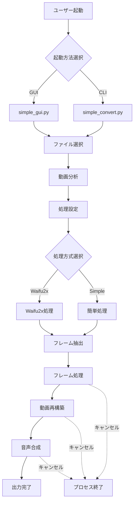
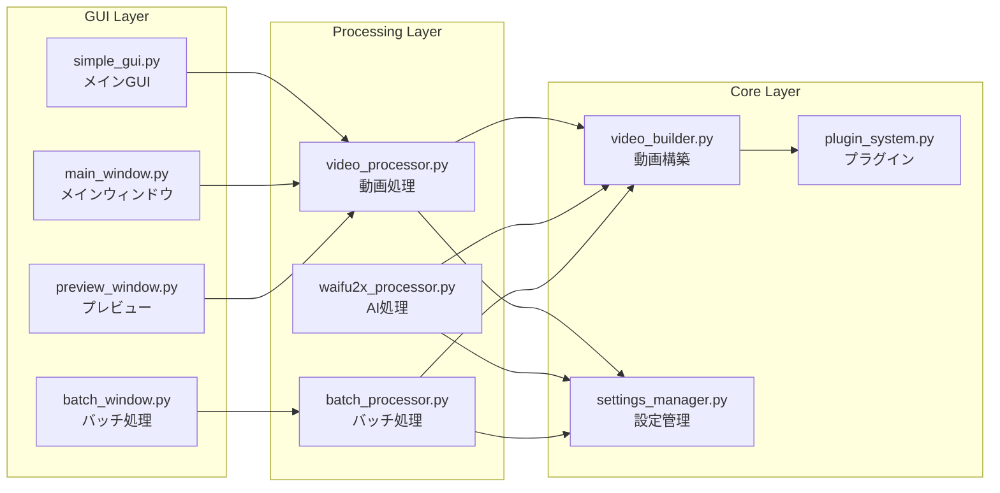
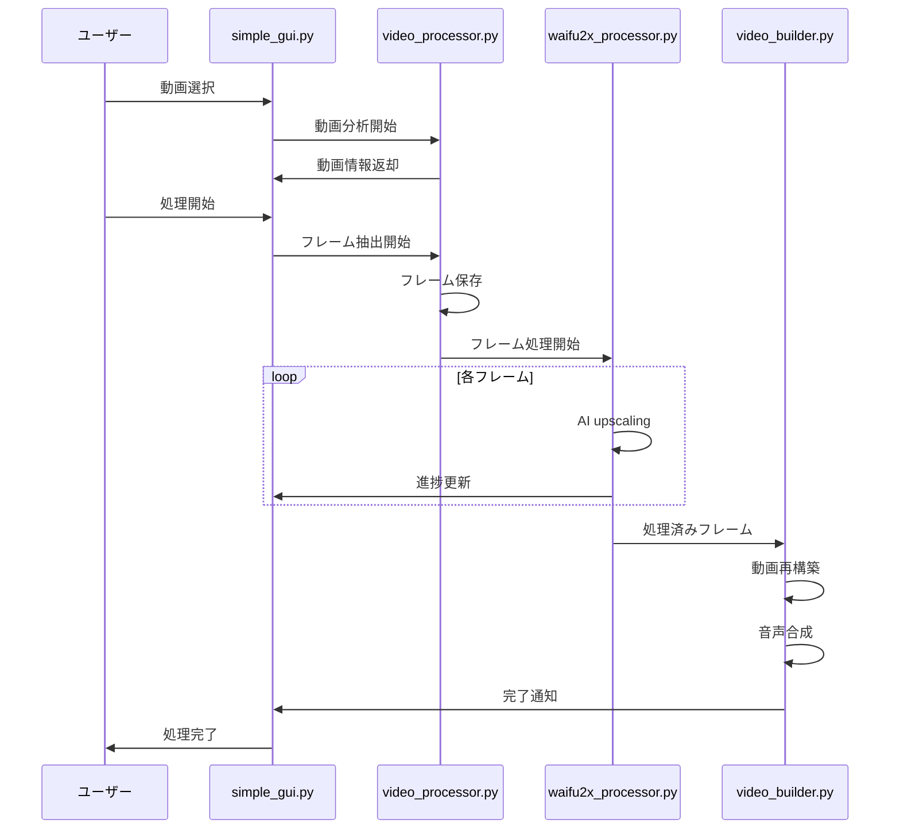
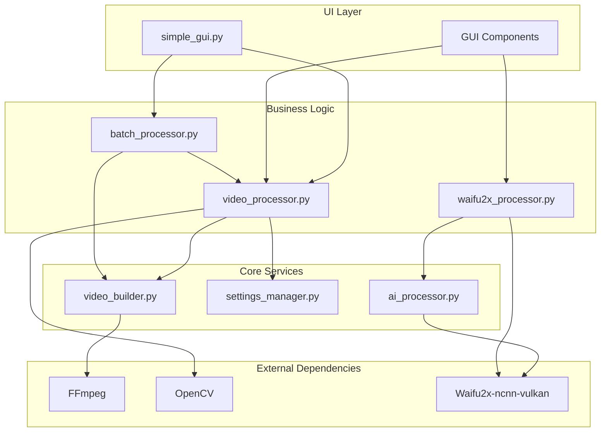
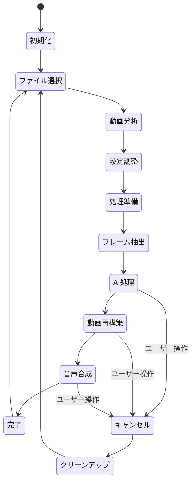
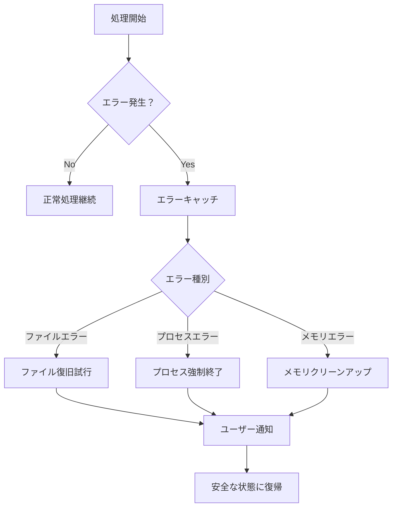

# UpScale App Project Architecture

このドキュメントはUpScale Appプロジェクトのファイル構成、アーキテクチャ、および処理フローについて詳しく解説します。

## 📁 プロジェクト構造

```
UpScaleAppProject/
├── 📄 メインファイル
│   ├── simple_gui.py          # メインGUIアプリケーション
│   ├── simple_convert.py      # 基本変換スクリプト  
│   ├── main.py               # コマンドライン版メイン
│   └── main_gui.py           # GUI版メイン
│
├── 🔧 設定・環境
│   ├── config/
│   │   └── settings.py       # アプリケーション設定
│   ├── setup_environment.py  # 環境セットアップ
│   ├── install_dependencies.py # 依存関係インストール
│   └── requirements*.txt     # 依存関係定義
│
├── 🎯 コアモジュール (src/)
│   ├── gui/                  # GUI コンポーネント
│   │   ├── main_window.py    # メインウィンドウ
│   │   ├── batch_window.py   # バッチ処理ウィンドウ
│   │   ├── preview_window.py # プレビューウィンドウ
│   │   └── plugin_manager_window.py # プラグイン管理
│   │
│   ├── modules/              # 処理モジュール
│   │   ├── video_processor.py    # 動画処理エンジン
│   │   ├── video_builder.py      # 動画再構築
│   │   ├── waifu2x_processor.py  # Waifu2x統合
│   │   ├── amd_waifu2x_backend.py # AMD GPU対応
│   │   ├── batch_processor.py    # バッチ処理
│   │   ├── ai_processor.py       # AI処理統合
│   │   └── settings_manager.py   # 設定管理
│   │
│   └── plugins/              # プラグインシステム
│       └── plugin_system.py # プラグイン管理
│
├── 📊 出力・ログ
│   ├── output/              # 処理済み動画出力
│   ├── logs/               # アプリケーションログ
│   └── temp/               # 一時ファイル（フレーム画像等）
│
└── 📚 ドキュメント
    ├── README.md           # プロジェクト概要
    ├── CHANGELOG.md        # 変更履歴
    └── docs/              # 詳細ドキュメント
```

## 🚀 アプリケーション処理フロー



## 🎨 GUI アーキテクチャ



## ⚙️ 動画処理パイプライン



## 🔧 モジュール間依存関係



## 📋 主要コンポーネント詳細

### 1. simple_gui.py - メインGUIアプリケーション
- **役割**: ユーザーインターフェースとメイン制御
- **主な機能**:
  - ファイル選択・動画分析
  - 処理設定UI（スケール、品質等）
  - 進捗表示とキャンセル処理
  - FFmpeg/Waifu2xテスト機能

### 2. video_processor.py - 動画処理エンジン
- **役割**: 動画ファイルの分析・フレーム抽出
- **主な機能**:
  - 動画メタデータ取得
  - フレーム単位での分解・保存
  - 処理進捗管理

### 3. waifu2x_processor.py - AI処理統合
- **役割**: Waifu2x AIモデルとの統合
- **主な機能**:
  - 複数バックエンド対応（NCNN-Vulkan等）
  - フレーム単位での高品質アップスケール
  - GPU処理最適化

### 4. video_builder.py - 動画再構築
- **役割**: 処理済みフレームからの動画再構築
- **主な機能**:
  - フレーム結合・動画生成
  - 音声トラック保持・同期
  - FFmpeg統合とプロセス管理

### 5. AMD GPU対応モジュール群
- **amd_gpu_detector.py**: AMD GPU検出
- **amd_waifu2x_backend.py**: AMD用Waifu2xバックエンド
- **amd_vulkan_waifu2x.py**: Vulkan最適化実装

## 🔄 処理フェーズと状態管理



## 🚨 エラーハンドリングとキャンセル処理

### プロセス管理機能
- **subprocess.Popen()**: プロセスID保持による適切な制御
- **キャンセル機能**: ユーザー操作によるいつでも中断可能
- **プロセス終了**: Windows/Unix対応の強制終了処理
- **リソース管理**: 一時ファイル・メモリの適切なクリーンアップ

### エラー処理フロー


このアーキテクチャにより、スケーラブルで保守性の高い動画アップスケールアプリケーションを実現しています。各モジュールは独立性を保ちながら、効率的な処理パイプラインを構成しています。