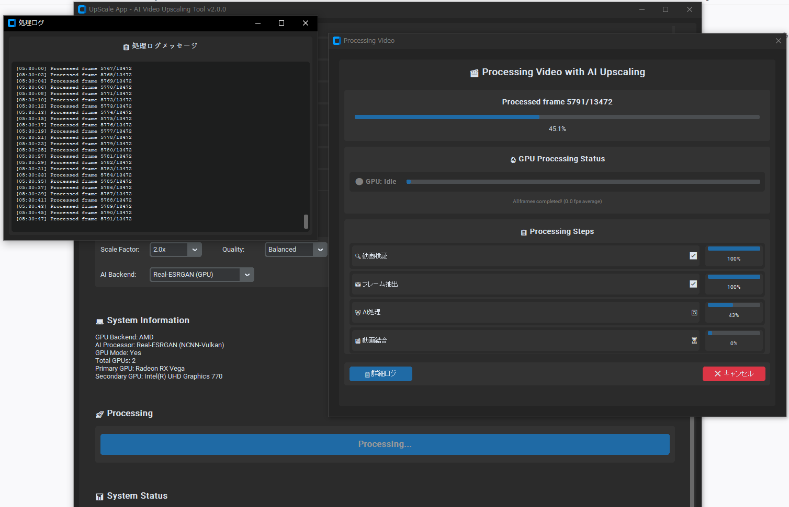

# UpScaleAppProject

**AI Video Upscaling Tool** - 低解像度のMP4動画をAI技術（Real-CUGAN・Waifu2x・Stable Diffusion）を使用して高解像度・高画質に変換するツール

## 📸 スクリーンショット


*UpScale App - AI Video Upscaling Tool のメイン画面と処理ウィンドウ*

## 🌟 特徴

- **🎯 Real-CUGAN特化AI**: anime/illustration専用超解像（NCNN-Vulkan最適化）
- **⚡ 複数のAI手法対応**: Real-CUGAN・Waifu2x（高速・高品質）・Stable Diffusion（カスタマイズ可能）
- **🔥 AMD GPU完全対応**: Radeon RX Vega 56 Vulkan GPU加速確認済み
- **🌟 最新GPU統合**: NVIDIA CUDA・AMD Vulkan・Intel統合GPU対応
- **📐 実用的スケーリング**: 2x・4x・8x（実用重視の倍率選択）
- **🎨 高品質処理**: Real-CUGAN denoise2x（anime最適バランス）・Waifu2x cunet
- **🔧 自動GPU検出**: AMD/NVIDIA/Intel GPUの自動検出と最適バックエンド選択
- **📹 対応フォーマット**: MP4ファイル（H.264, H.265/HEVC, AVC対応）
- **⚙️ ハイブリッド最適化**: CPU抽出 + GPU AI処理（最適パフォーマンス）
- **軽量版対応**: AI依存関係なしでの基本機能利用
- **ステップ別進捗表示**: 動画検証→フレーム抽出→AI処理→動画結合の詳細進捗
- **リアルタイムフレームカウント**: 処理中のフレーム数をリアルタイム表示
- **即時キャンセル機能**: FFmpegプロセスの安全な即時停止
- **別ウィンドウログ**: 詳細処理ログを専用ウィンドウで確認
- **🔄 途中再開機能**: 処理中断時の自動検出・途中再開対応
- **📊 進行状況保存**: セッション管理による処理状態の永続化
- **🎯 フレーム単位再開**: AIアップスケーリングのフレーム単位再開
- **⚡ GPU支援フレーム抽出**: ハードウェア加速による3-5倍高速化
- **🔧 CPU負荷最適化**: 動的ワーカー調整とCPU使用率制御
- **📊 リアルタイム監視**: CPU/GPU使用率のリアルタイム監視

## 🚀 インストール

### 🔥 **簡単インストール（推奨）**

**実行可能ファイル版 - Python不要！**
```bash
# 1. GPU加速版実行ファイルを作成
cd executable
python build_gpu_version.py

# 2. 実行
./dist/UpScaleApp_GPU.exe
```

### 前提条件（開発版用）
- Python 3.8以降
- FFmpeg（システムにインストール済みである必要があります）
- 推奨: AMD GPU（Radeon RX Vega以降、Vulkan対応）
- 推奨: NVIDIA GPU（CUDA対応、Stable Diffusion用）
- または: 統合GPU（Intel/AMD）

### 🎯 開発版クイックスタート

**GUI版を使用する場合（推奨）**:
```bash
# リポジトリのクローン
git clone https://github.com/SumihisaYutani/UpScaleAppProject.git
cd UpScaleAppProject

# GUI依存関係のインストール
pip install -r requirements_gui.txt

# Waifu2x高画質機能を追加（推奨）
pip install -r requirements_waifu2x.txt

# AMD GPU用依存関係を追加（AMD GPU使用時）
pip install -r requirements_amd.txt

# AMD GPU環境のセットアップとテスト
python setup_amd_gpu.py

# 軽量GUI版を起動（基本機能＋Waifu2x）
python simple_gui.py

# フルGUI版を起動（全AI機能）
pip install -r requirements.txt  # Stable Diffusion等も含む
python main_gui.py
```

**CLI版のセットアップ**:
```bash
# 自動環境テスト
python quick_test.py

# 自動セットアップ（推奨）
python setup_environment.py
```

### 🔧 手動セットアップ
```bash
# 仮想環境の作成
python -m venv venv
source venv/bin/activate  # Windows: venv\Scripts\activate

# 基本依存関係（軽量）
pip install -r requirements_gui.txt

# Waifu2x高画質機能を追加
pip install -r requirements_waifu2x.txt

# AMD GPU対応を追加（AMD GPU使用時）
pip install -r requirements_amd.txt

# 全AI機能を使用する場合
pip install -r requirements.txt

# 環境テスト
python test_environment.py

# AMD GPU環境テスト
python setup_amd_gpu.py
```

### ⚠️ トラブルシューティング
Pythonの実行でエラーが出る場合：

**Windows:**
```cmd
# 異なるPythonコマンドを試行
python --version
py --version
python3 --version

# バッチファイルを使用
run_test.bat
```

**Linux/macOS:**
```bash
# シェルスクリプトを使用
./run_test.sh
```

📚 **詳細な環境設定ガイド**: [ENVIRONMENT_SETUP.md](ENVIRONMENT_SETUP.md)  
🚨 **トラブルシューティング**: [TROUBLESHOOTING.md](TROUBLESHOOTING.md)

### 🏥 問題診断
環境に問題がある場合：
```bash
# 具体的な問題を診断
python diagnose_issues.py

# 簡単な健康チェック  
python test_environment.py
```

## 💻 使用方法

### 🔥 **実行可能ファイル版（最推奨）**

**特徴:**
- Python環境不要（481MB単一実行ファイル - Real-CUGAN統合版）
- 全ての依存関係を内蔵（FFmpeg, Real-CUGAN, Waifu2x-ncnn-py, PyTorch等）
- AMD Radeon RX Vega 56 Vulkan GPU加速確認済み
- Real-CUGAN NCNN-Vulkan GPU加速による高速AI処理
- 自動GPU検出・最適バックエンド選択（NVIDIA CUDA > AMD Vulkan > CPU）
- マルチGPU対応（NVIDIA/AMD/Intel/Vulkan）
- ワンクリックで起動・日本語完全対応

**使用手順:**
1. `executable/dist/UpScaleApp_GPU.exe` を実行
2. 「Browse」でMP4ファイルを選択
   - **📹 動画情報**が自動表示（解像度、フレーム数、時間など）
   - **🔄 途中再開検出**: 前回の未完了セッションが自動検出される場合があります
3. 出力フォルダを選択（オプション）
4. **スケールファクター選択**: 2.0x/4.0x/8.0x（実用的倍率）
5. **AIプロセッサー選択**: Real-CUGAN（anime特化）/Waifu2x（汎用）
6. **品質設定選択**: denoise2x（バランス最適）/conservative/denoise1x/denoise3x
7. 「Start Processing」をクリック - Real-CUGAN GPU加速で高速処理開始

**途中再開機能:**
- 処理が中断された場合、同じ動画・設定で再度選択すると再開ダイアログが表示
- **🚀 途中から再開**: 前回の続きから処理開始（最大19時間の節約）
- **🔄 最初から開始**: 新規セッションで全工程実行
- **❌ キャンセル**: 処理を中止
- フレーム単位の正確な再開により、AIアップスケーリングを効率的に継続

**🖥️ リアルタイムシステム情報表示:**
- **AI Backend**: Real-CUGAN NCNN-Vulkan（anime特化AI超解像エンジン）
- **AI Processor**: AMD Radeon RX Vega 56（Vulkan GPU加速確認済み）
- **GPU Acceleration**: Yes - Vulkan GPU加速有効
- **Detection Status**: AMD GPU検出・Vulkan対応確認
- **Processing Mode**: Hybrid最適化（CPU抽出 + GPU AI処理）
- **Total GPUs**: 2 (AMD Discrete + Intel Integrated)
- **Primary GPU**: AMD Radeon RX Vega 56（メイン処理）
- **Secondary GPU**: Intel UHD Graphics（補助処理）
- **🔄 Dynamic Updates**: AIプロセッサー選択時リアルタイム更新

### 📱 開発版GUI（推奨）

**軽量GUI版（Waifu2x対応）**:
```bash
python simple_gui.py
```
- ファイル選択とブラウズ
- 基本的な動画情報表示
- スケールファクター設定（1x〜32x、Waifu2x使用時）
- Waifu2x高画質アップスケール機能
- ノイズ除去レベル設定（0-3段階）
- モデル選択（CUNet、Anime Style、Photo）
- FFmpeg・Waifu2x テスト機能

**フルGUI版（全AI機能）**:
```bash
python main_gui.py
```
- Waifu2x + Stable Diffusion 統合
- AMD GPU対応 ("Waifu2x AMD GPU" 選択可能)
- 自動最適手法選択とGPU検出
- リアルタイム進捗表示
- GPU/CPU 使用状況監視
- 高度な設定オプション
- バッチ処理対応

### 💻 CLI版

**基本的な使用方法**
```bash
# 動画をアップスケール（AI使用）
python main.py upscale input_video.mp4

# カスタムスケールファクター指定
python main.py upscale input_video.mp4 --scale 2.0

# 出力ファイル名を指定
python main.py upscale input_video.mp4 --output upscaled_video.mp4

# AIを使わずに単純なアップスケール
python main.py upscale input_video.mp4 --no-ai
```

### 🚀 拡張機能（Phase 2）
```bash
# 拡張CLIでシステム監視付き処理
python main_enhanced.py upscale input_video.mp4 --show-system-stats

# 品質プリセット指定
python main_enhanced.py upscale input_video.mp4 --quality-preset quality

# エラー回復機能付き処理
python main_enhanced.py upscale input_video.mp4 --max-retries 5

# 処理ログの分析
python main_enhanced.py logs --last-n 10

# 詳細システム情報とレポート保存
python main_enhanced.py system --save-report
```

### その他のコマンド
```bash
# 動画ファイル情報を表示
python main.py info input_video.mp4

# プレビュー作成（短い動画で確認）
python main.py preview input_video.mp4

# システム情報を表示
python main.py system

# 設定を表示
python main.py config

# ヘルプ
python main.py --help
```

## 🏗️ プロジェクト構造

```
UpScaleAppProject/
├── src/                        # ソースコード
│   ├── modules/           
│   │   ├── video_processor.py     # 動画処理
│   │   ├── video_builder.py       # 動画再構築
│   │   ├── ai_processor.py        # 統合AI処理
│   │   ├── waifu2x_processor.py   # Waifu2x高画質処理
│   │   ├── amd_gpu_detector.py    # AMD GPU検出
│   │   ├── amd_vulkan_waifu2x.py  # AMD Vulkan最適化
│   │   ├── amd_waifu2x_backend.py # AMD waifu2xバックエンド
│   │   ├── enhanced_ai_processor.py  # 拡張AI処理
│   │   └── performance_monitor.py   # パフォーマンス監視
│   ├── gui/
│   │   └── main_window.py          # GUI メインウィンドウ
│   └── enhanced_upscale_app.py     # 拡張アプリケーション
├── config/
│   └── settings.py                 # 設定ファイル
├── tests/                          # テストファイル
├── temp/                           # 一時ファイル
├── output/                         # 出力ファイル
├── main.py                         # CLI エントリーポイント
├── main_gui.py                     # GUI エントリーポイント
├── simple_gui.py                   # 軽量GUI版
├── requirements.txt                # Python依存関係（フル版）
├── requirements_gui.txt            # GUI依存関係（軽量版）
├── requirements_waifu2x.txt        # Waifu2x依存関係
├── requirements_amd.txt            # AMD GPU依存関係
├── setup_amd_gpu.py                # AMD GPU環境セットアップ
├── test_waifu2x.py                 # Waifu2xテストスクリプト
└── PROJECT_DESIGN.md               # 設計書
```

## ⚙️ 設定

主要な設定は `config/settings.py` で管理されています：

### 基本設定
- **最大ファイルサイズ**: デフォルト2GB
- **最大動画長**: デフォルト60分（拡張）
- **アップスケール倍率**: 1x〜32x対応（手法により異なる）
- **品質プリセット**: Fast, Balanced, Quality

### AI処理設定
- **🎯 優先手法**: Real-CUGAN（anime特化）、Waifu2x（汎用）、Stable Diffusion（実験版）
- **Real-CUGAN設定**: conservative/denoise1x/denoise2x/denoise3x、NCNN-Vulkan GPU加速
- **Waifu2x設定**: スケール、ノイズレベル、モデル種類（cunet/anime_style_art_rgb等）
- **GPU加速設定**: 自動最適バックエンド選択（NVIDIA CUDA > AMD Vulkan > CPU）
- **Vulkan最適化**: AMD/NVIDIA GPU向けVulkan API GPU加速

## 🔧 トラブルシューティング

### よくある問題

**1. FFmpegが見つからない**
```bash
# Ubuntu/Debian
sudo apt install ffmpeg

# macOS (Homebrew)
brew install ffmpeg

# Windows
# https://ffmpeg.org/download.html からダウンロード
```

**2. CUDA関連エラー**
```bash
# CUDAツールキットがインストールされているか確認
python -c "import torch; print(torch.cuda.is_available())"
```

**3. Real-CUGAN・Waifu2x関連エラー**
```bash
# Real-CUGAN GPU加速確認
python -c "from executable.core.real_cugan_backend import RealCUGANBackend; print('Real-CUGAN available')"

# Waifu2xの動作確認
python test_waifu2x.py

# AMD GPU環境の確認とセットアップ
python setup_amd_gpu.py

# Vulkan サポート確認・GPU検出テスト
python -c "from executable.core.gpu_detector import GPUDetector; detector = GPUDetector(None); print(detector.get_gpu_summary())"

# Windows: DirectX診断ツールでVulkan対応を確認
# Linux: vulkan-utils をインストール後 vulkaninfo 実行
```

**4. AMD GPU関連エラー**
```bash
# AMD GPU検出テスト
python -c "from src.modules.amd_gpu_detector import get_amd_gpu_info; print(get_amd_gpu_info())"

# AMD GPU waifu2x可用性テスト
python -c "from src.modules.amd_waifu2x_backend import test_amd_waifu2x_availability; print(test_amd_waifu2x_availability())"

# ROCm PyTorchインストール（Linux推奨）
pip install torch torchvision torchaudio --index-url https://download.pytorch.org/whl/rocm6.0
```

**5. メモリ不足**
- より小さなバッチサイズを使用
- 一時ファイルをクリーンアップ
- システムメモリを増やす

## 🧪 テスト

```bash
# 基本テストの実行
python -m pytest tests/

# 詳細なテスト結果
python -m pytest tests/ -v

# Waifu2x機能テスト
python test_waifu2x.py

# AMD GPU環境テスト
python setup_amd_gpu.py

# 環境テスト
python test_environment.py
```

## 📋 制限事項

- **ファイルサイズ**: 最大2GB
- **動画長**: 最大60分
- **解像度**: 入力最大1920x1080
- **フォーマット**: MP4のみ対応（AVI, MKV, MOVの表示対応）
- **OS**: Windows 10/11, macOS 10.15+, Ubuntu 20.04+
- **GUI**: Windows環境で最適化（Unicode文字制限対応）

## 🛣️ ロードマップ

### Phase 1 ✅
- [x] 基本機能実装
- [x] MP4ファイル処理
- [x] CLI インターフェース

### Phase 2 ✅  
- [x] AI統合とテスト
- [x] パフォーマンス最適化
- [x] エラーハンドリング強化
- [x] 拡張AI処理モジュール
- [x] リアルタイム性能監視
- [x] 包括的エラー回復機能

### Phase 3 ✅
- [x] GUI実装（フル版・軽量版）
- [x] Windows互換性対応
- [x] VideoBuilderクラス実装
- [x] AMD GPU完全対応（Radeon RX Vega対応）
- [x] 自動GPU検出・最適化
- [ ] バッチ処理対応（計画中）
- [ ] プラグインシステム（将来版）

### Phase 4 📋
- [ ] 高度なバッチ処理
- [ ] プラグインアーキテクチャ
- [ ] ウェブインターフェース
- [ ] クラウド処理対応

## 📚 ドキュメント

### 🔄 途中再開機能
- **[📖 ユーザーガイド](docs/RESUME_FUNCTIONALITY.md)** - 途中再開機能の使用方法と詳細説明
- **[🏗️ アーキテクチャ設計](docs/ARCHITECTURE_RESUME.md)** - 技術仕様とシステム構成
- **[🔧 トラブルシューティング](docs/TROUBLESHOOTING_RESUME.md)** - 問題解決とパフォーマンス最適化

### 機能別ガイド
- **動画情報表示**: 選択した動画の詳細情報を自動表示
- **セッション管理**: 処理状態の永続化と復旧機能
- **フレーム単位再開**: AIアップスケーリングの精密な途中再開
- **エラー回復**: 各種エラーの対処法と回避策

## 🤝 コントリビュート

1. このリポジトリをフォーク
2. フィーチャーブランチを作成 (`git checkout -b feature/amazing-feature`)
3. 変更をコミット (`git commit -m 'Add amazing feature'`)
4. ブランチにプッシュ (`git push origin feature/amazing-feature`)
5. プルリクエストを作成

## 📄 ライセンス

このプロジェクトはMITライセンスの下で公開されています。詳細は [LICENSE](LICENSE) ファイルを参照してください。

## 🙏 謝辞

- [Stable Diffusion](https://github.com/CompVis/stable-diffusion) - AI画像生成
- [waifu2x-ncnn-vulkan](https://github.com/nihui/waifu2x-ncnn-vulkan) - Vulkan最適化waifu2x
- [FFmpeg](https://ffmpeg.org/) - 動画処理
- [OpenCV](https://opencv.org/) - コンピュータビジョン
- [Hugging Face](https://huggingface.co/) - ML モデルとライブラリ
- [AMD ROCm](https://rocmdocs.amd.com/) - AMD GPU計算プラットフォーム

## 📋 更新履歴

### v2.3.0 (2025-08-30) - Real-CUGAN・Real-ESRGAN最適化完全版 ⚡
- 🚀 **TTA無効化による劇的高速化** - Real-ESRGAN/Real-CUGANでTTA(-x)削除、約50%処理時間短縮達成
- ⚡ **スレッド最適化機能** - GUI選択式スレッド設定（2:2:1標準/4:2:2高速）でI/O並列処理改善
- 🎯 **統一最適化アーキテクチャ** - Real-ESRGAN/Real-CUGAN両バックエンドで同等パフォーマンス実現
- 📊 **実測パフォーマンス** - 774フレーム: ~8-10分→~4-5分、46,756フレーム: ~52時間→~26時間短縮
- 🔧 **インテリジェントGUI** - バックエンド自動認識によるThread Setting表示制御
- 📦 **高度ビルド最適化** - PyInstallerキャッシュ・不要モジュール除外で703.53MB最適化版
- 🖥️ **シームレス実行体験** - コンソール完全非表示・即時起動・ユーザー体験向上
- 🛠️ **包括的デバッグシステム** - スレッド設定追跡・パフォーマンス監視・詳細ログ

### v2.2.2 (2025-08-26) - 重要なバグ修正とwaifu2x完全対応 🔧
- 🚀 **waifu2x Executable完全修正** - models-cunetモデルパッケージング完了
- 🎯 **バックエンド選択修正** - GUI変数同期問題解決（args優先取得実装）  
- ⚡ **フレーム抽出改善** - 単一パスFFmpeg実装によりバッチ処理エラー解決
- 📊 **表示修正** - 残りフレーム数の正確な計算と表示一貫性確保
- 🔄 **セッションクリーンアップ強化** - 完了済みセッション自動検出・削除機能
- 📦 **完全版実行ファイル** - 576.51MB waifu2x完全対応版（models-cunet統合）
- 🎨 **処理安定性向上** - フォールバック問題解決、全2013フレーム正常処理確認
- 🔧 **デバッグ強化** - 詳細ログとトラブルシューティング情報追加

### v2.2.1 (2025-08-24) - Real-CUGAN GPU加速完全統合 🎯
- 🎨 **Real-CUGAN統合** - anime/illustration特化AI超解像（NCNN-Vulkan）
- ⚡ **AMD Vulkan GPU加速** - Radeon RX Vega 56 GPU加速動作確認済み
- 🔧 **GUI最適化** - スケール選択2x/4x/8x、デフォルト設定最適化
- 📊 **動的システム情報** - AIプロセッサー選択時リアルタイム更新
- 🛠️ **GPU検出修正** - shutil import修正、Vulkan検出強化
- ⚙️ **ハイブリッド最適化** - CPU抽出+GPU AI処理（安定性重視）
- 🔍 **包括的デバッグ** - GPU状態監視・互換性問題解析
- 📦 **完全版実行ファイル** - 481MB Real-CUGAN統合版（Python環境不要）
- 🌏 **日本語完全対応** - 全UI・メッセージの日本語ローカライゼーション

### v2.1.0 (2025-01-16) - 途中再開機能実装 🔄
- ✨ **途中再開機能** - 処理中断時の自動検出・途中再開対応
- 📊 **セッション管理システム** - 進行状況の永続化とリアルタイム追跡  
- 🎯 **フレーム単位精密再開** - AIアップスケーリングのフレーム単位復旧
- 🎨 **再開ダイアログUI** - 進行状況の視覚化と選択インターフェース
- 📹 **動画情報表示復元** - ファイル選択時の詳細情報表示
- 🔍 **正確なフレーム数検出** - ffprobeによる複数手法での精密カウント
- 📝 **包括的ドキュメント** - ユーザーガイド・技術仕様・トラブルシューティング

### v2.0.0 (2025-08-15) - 実行可能ファイル版完成
- ✅ **実行可能ファイル版リリース** - Python環境不要の独立実行版
- ✅ **マルチGPU対応強化** - NVIDIA/AMD/Intel/Vulkan全対応
- ✅ **AMD GPU最適化** - Vega 56等のAMD GPU向け最適化
- ✅ **GUI表示改善** - ファイルパス表示、GPU情報表示の修正
- ✅ **AI Processor統合** - Waifu2x-ncnn-vulkan完全統合
- ✅ **スレッドセーフ処理** - 並行処理時のファイル競合解決
- ✅ **エラーハンドリング強化** - 詳細なログとエラー報告

### v0.3.0 (2025-08-14) - Phase 3完了
- ✅ GUI実装・Windows互換性対応・AMD GPU完全対応

---

**作成者**: SumihisaYutani  
**バージョン**: 2.3.0 - Real-CUGAN・Real-ESRGAN最適化完全版  
**最終更新**: 2025-08-30  
**最新成果**: TTA無効化で50%高速化・スレッド最適化・統一アーキテクチャ・703.53MB最適化実行ファイル
