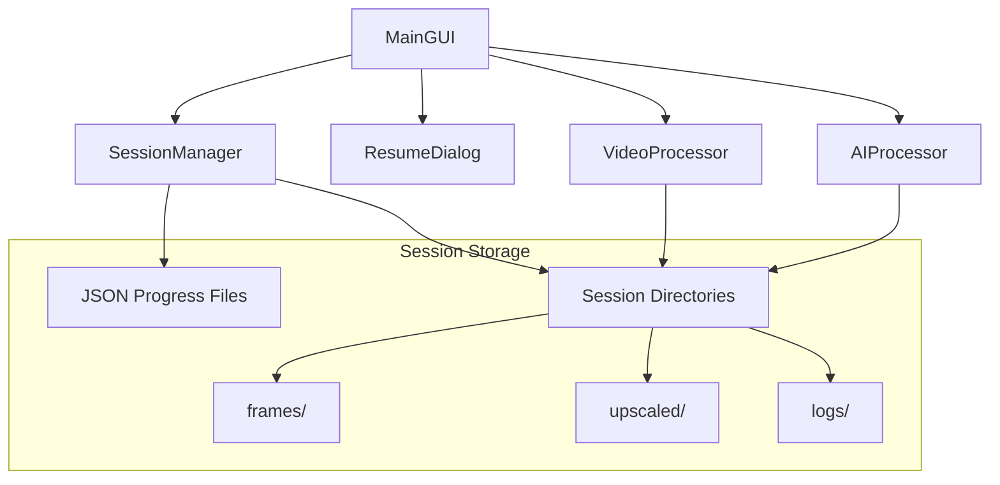
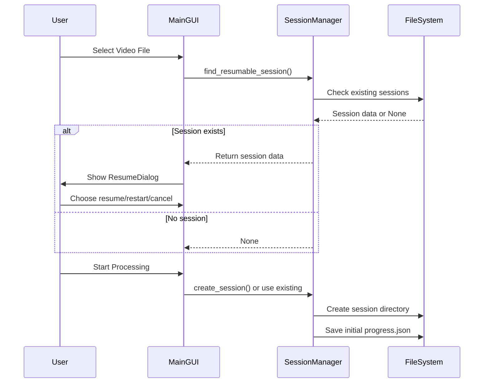
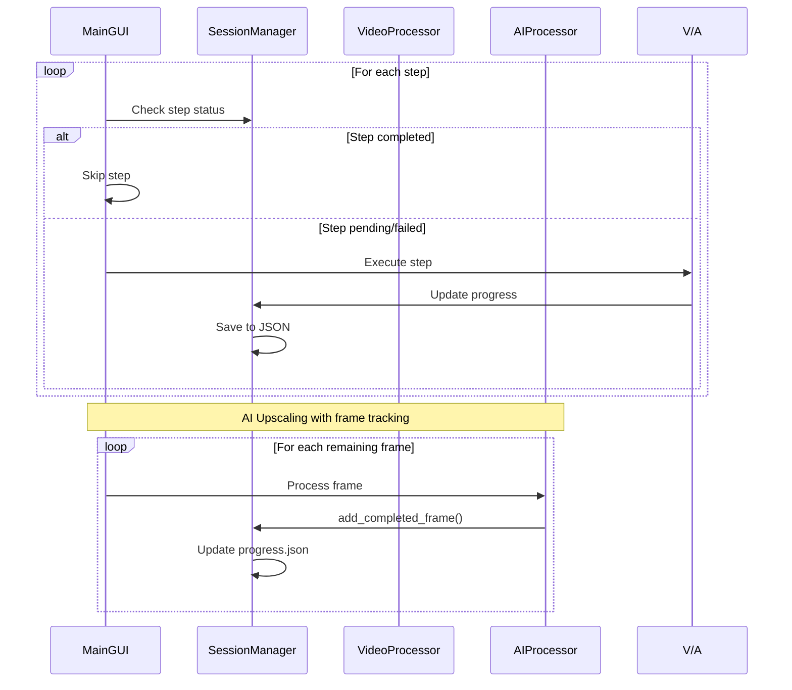
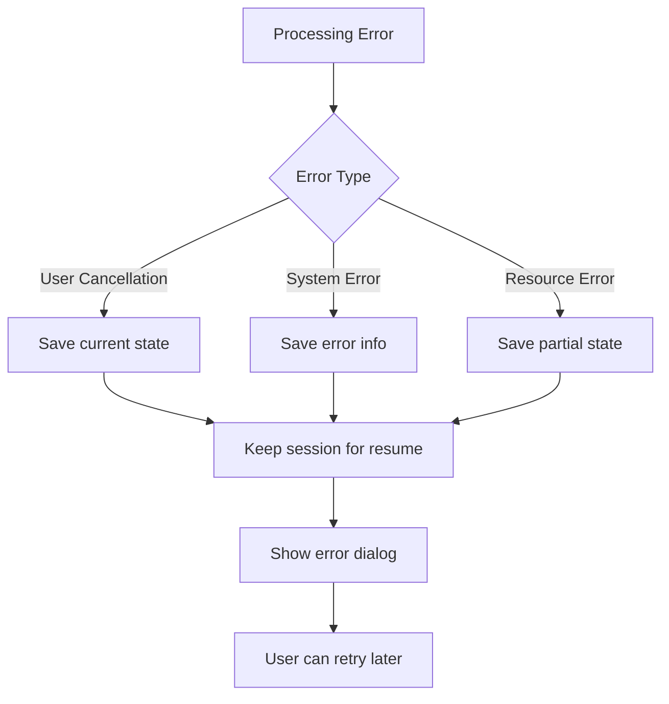

# 🏗️ 途中再開機能 - アーキテクチャ設計

## 📋 概要

途中再開機能は、長時間のAI動画処理を中断から安全に復旧するためのセッション管理システムです。

## 🎯 設計目標

### 主要要件
- **信頼性**: データ損失なしでの中断・再開
- **効率性**: 処理済み部分のスキップと未処理部分のみの継続
- **使いやすさ**: ユーザーフレンドリーな再開インターフェース
- **拡張性**: 将来の機能追加に対応できる柔軟な設計

### 非機能要件
- **パフォーマンス**: セッション管理のオーバーヘッドを最小限に
- **耐久性**: プロセス異常終了からの復旧
- **保守性**: モジュール化された設計

## 🏛️ システム構成



## 📦 コンポーネント設計

### 1. SessionManager クラス

#### 責務
- セッションライフサイクル管理
- 進行状況の永続化
- セッション検索・検証
- 自動クリーンアップ

#### 主要メソッド
```python
class SessionManager:
    def create_session(self, video_path: str, settings: dict, video_info: dict) -> str
    def find_resumable_session(self, video_path: str, settings: dict) -> dict
    def save_progress(self, session_id: str, progress_data: dict) -> None
    def load_progress(self, session_id: str) -> dict
    def update_step_status(self, session_id: str, step: str, status: str) -> None
    def add_completed_frame(self, session_id: str, frame_path: str) -> None
    def cleanup_session(self, session_id: str) -> None
```

#### データフロー
```
Input Video + Settings → Session ID (MD5 Hash)
Session ID → Session Directory Creation
Progress Updates → JSON File Updates
Session Completion → Automatic Cleanup
```

### 2. ResumeDialog クラス

#### 責務
- ユーザーインターフェース提供
- セッション情報の視覚化
- ユーザー選択の処理

#### UI構成
```
┌─────────────────────────────────────┐
│ 🔄 前回の処理が見つかりました        │
├─────────────────────────────────────┤
│ 📹 動画ファイル: sample.mp4         │
│ 📅 最終更新: 2025-01-16 21:13:32   │
│ ⚙️ 拡大率: 2.0x                     │
│ 🎯 品質: Quality                    │
├─────────────────────────────────────┤
│ 📊 処理進行状況                     │
│ ✅ 動画検証     [████████████] 100% │
│ ✅ フレーム抽出 [████████████] 100% │
│ 🔄 AI処理      [█░░░░░░░░░░░]   2.6% │
│ ⏳ 動画結合     [░░░░░░░░░░░░]   0%  │
├─────────────────────────────────────┤
│ [🚀 途中から再開] [🔄 最初から] [❌] │
└─────────────────────────────────────┘
```

### 3. 処理統合部分

#### MainGUI 拡張
```python
class MainGUI:
    def __init__(self):
        self.session_manager = SessionManager()
        self.current_session_id = None
    
    def _browse_input(self):
        # 動画選択時の再開チェック
        self._check_resumable_sessions(file_path)
    
    def _start_processing(self):
        # セッション初期化または再開
        if not self.current_session_id:
            self.current_session_id = self.session_manager.create_session(...)
```

#### 処理ステップ統合
```python
# 各ステップでの状態確認・更新
def process_video():
    # Step 1: Validation
    if validate_status != 'completed':
        # 実行 + 状態更新
        self.session_manager.update_step_status(session_id, "validate", "completed")
    else:
        # スキップ
        
    # Step 2: Frame Extraction  
    if extract_status != 'completed':
        # 実行 + 状態更新
        self.session_manager.update_step_status(session_id, "extract", "completed")
    else:
        # 既存フレーム読み込み
        
    # Step 3: AI Upscaling (フレーム単位)
    completed_frames = self.session_manager.get_completed_frames(session_id)
    remaining_frames = self.session_manager.get_remaining_frames(session_id, all_frames)
    for frame in remaining_frames:
        # フレーム処理 + 個別状態更新
        self.session_manager.add_completed_frame(session_id, upscaled_frame)
```

## 💾 データモデル

### セッション識別

#### セッションID生成アルゴリズム
```python
def generate_session_id(video_path: str, settings: dict) -> str:
    video_stat = Path(video_path).stat()
    session_data = {
        'video_path': str(Path(video_path).resolve()),
        'video_size': video_stat.st_size,           # ファイルサイズ
        'video_mtime': video_stat.st_mtime,         # 更新時刻
        'scale_factor': settings['scale_factor'],   # 処理設定
        'quality': settings['quality'],
        'noise_reduction': settings.get('noise_reduction', 3)
    }
    return hashlib.md5(json.dumps(session_data, sort_keys=True).encode()).hexdigest()[:12]
```

### 進行状況スキーマ

#### JSON構造定義
```typescript
interface ProgressData {
  session_id: string;
  video_file: string;
  video_info: VideoInfo;
  settings: ProcessingSettings;
  created_at: string;          // ISO 8601
  last_updated: string;        // ISO 8601
  status: 'created' | 'in_progress' | 'completed' | 'failed';
  steps: {
    [stepName: string]: StepProgress;
  };
}

interface StepProgress {
  status: 'pending' | 'in_progress' | 'completed' | 'failed';
  progress: number;            // 0-100
  start_time?: string;
  end_time?: string;
  error?: string;
  // ステップ固有データ
  [key: string]: any;
}

interface VideoInfo {
  width: number;
  height: number;
  duration: number;
  frame_rate: number;
  frame_count: number;
  codec_name: string;
  size: number;
  format: string;
}
```

### ファイルシステム設計

#### ディレクトリ構造
```
%TEMP%/upscale_app_sessions/
├── [session_id_1]/
│   ├── progress.json                    # 進行状況データ
│   ├── frames/                         # 抽出フレーム
│   │   ├── frame_000001.png
│   │   ├── frame_000002.png
│   │   └── ...
│   ├── upscaled/                       # アップスケール済み
│   │   ├── frame_000001_upscaled.png
│   │   ├── frame_000002_upscaled.png
│   │   └── ...
│   └── logs/                           # セッションログ
│       └── session.log
├── [session_id_2]/
│   └── ...
└── ...
```

#### ファイル命名規則
- **セッションID**: 12文字のMD5ハッシュ
- **フレーム**: `frame_NNNNNN.png` (6桁ゼロパディング)
- **アップスケール済み**: `frame_NNNNNN_upscaled.png`
- **進行状況**: `progress.json`

## 🔄 処理フロー

### 1. セッション作成フロー



### 2. 処理実行フロー



### 3. エラー処理フロー



## ⚡ パフォーマンス考慮事項

### セッション管理オーバーヘッド

#### JSON更新頻度
```python
# フレーム単位での更新（最適化）
BATCH_UPDATE_SIZE = 10  # 10フレームごとに更新

frame_count = 0
for frame in frames:
    process_frame(frame)
    frame_count += 1
    
    if frame_count % BATCH_UPDATE_SIZE == 0:
        session_manager.batch_update_completed_frames(completed_frames)
```

#### メモリ使用量最適化
```python
# 大きなフレームリストの部分読み込み
def get_remaining_frames(self, session_id: str, all_frames: List[str]) -> List[str]:
    completed_set = set(self.get_completed_frames(session_id))
    return [f for f in all_frames if f not in completed_set]
```

### ディスク I/O 最適化

#### 非同期JSON保存
```python
import threading
from queue import Queue

class AsyncProgressSaver:
    def __init__(self):
        self.save_queue = Queue()
        self.worker_thread = threading.Thread(target=self._save_worker, daemon=True)
        self.worker_thread.start()
    
    def _save_worker(self):
        while True:
            session_id, progress_data = self.save_queue.get()
            self._save_to_disk(session_id, progress_data)
```

## 🛡️ 信頼性設計

### データ整合性

#### アトミック更新
```python
def save_progress(self, session_id: str, progress_data: dict):
    progress_file = self.get_progress_file(session_id)
    temp_file = f"{progress_file}.tmp"
    
    # 一時ファイルに書き込み
    with open(temp_file, 'w') as f:
        json.dump(progress_data, f)
    
    # アトミックな移動
    os.rename(temp_file, progress_file)
```

#### データ検証
```python
def validate_session_data(self, progress_data: dict) -> bool:
    required_fields = ['session_id', 'video_file', 'steps']
    return all(field in progress_data for field in required_fields)
```

### エラー回復

#### 破損ファイル検出
```python
def load_progress(self, session_id: str) -> Optional[dict]:
    try:
        with open(progress_file, 'r') as f:
            data = json.load(f)
        
        if self.validate_session_data(data):
            return data
        else:
            logger.warning(f"Invalid session data: {session_id}")
            return None
            
    except (json.JSONDecodeError, FileNotFoundError):
        logger.error(f"Corrupted session file: {session_id}")
        return None
```

## 🔮 将来の拡張

### 予定機能

#### クラウド同期
```python
class CloudSessionManager(SessionManager):
    def sync_to_cloud(self, session_id: str):
        # AWS S3 / Google Drive 同期
        pass
    
    def restore_from_cloud(self, session_id: str):
        # クラウドからの復元
        pass
```

#### AI予測再開点
```python
class SmartResumeManager:
    def suggest_optimal_resume_point(self, session_id: str) -> int:
        # 処理時間予測に基づく最適再開フレーム提案
        pass
```

#### 分散処理対応
```python
class DistributedSessionManager:
    def create_distributed_session(self, video_path: str, node_count: int):
        # 複数ノード間でのセッション分散
        pass
```

## 📊 モニタリング

### メトリクス収集

#### セッション統計
```python
class SessionMetrics:
    def collect_metrics(self) -> dict:
        return {
            'total_sessions': self.count_total_sessions(),
            'active_sessions': self.count_active_sessions(), 
            'average_completion_time': self.calculate_avg_completion(),
            'resume_success_rate': self.calculate_resume_rate(),
            'disk_usage': self.calculate_disk_usage()
        }
```

#### パフォーマンス監視
```python
class PerformanceMonitor:
    def track_resume_time(self, session_id: str):
        # 再開時間の測定
        pass
    
    def track_save_performance(self):
        # JSON保存性能の監視
        pass
```

この設計により、堅牢で拡張可能な途中再開機能を実現しています。