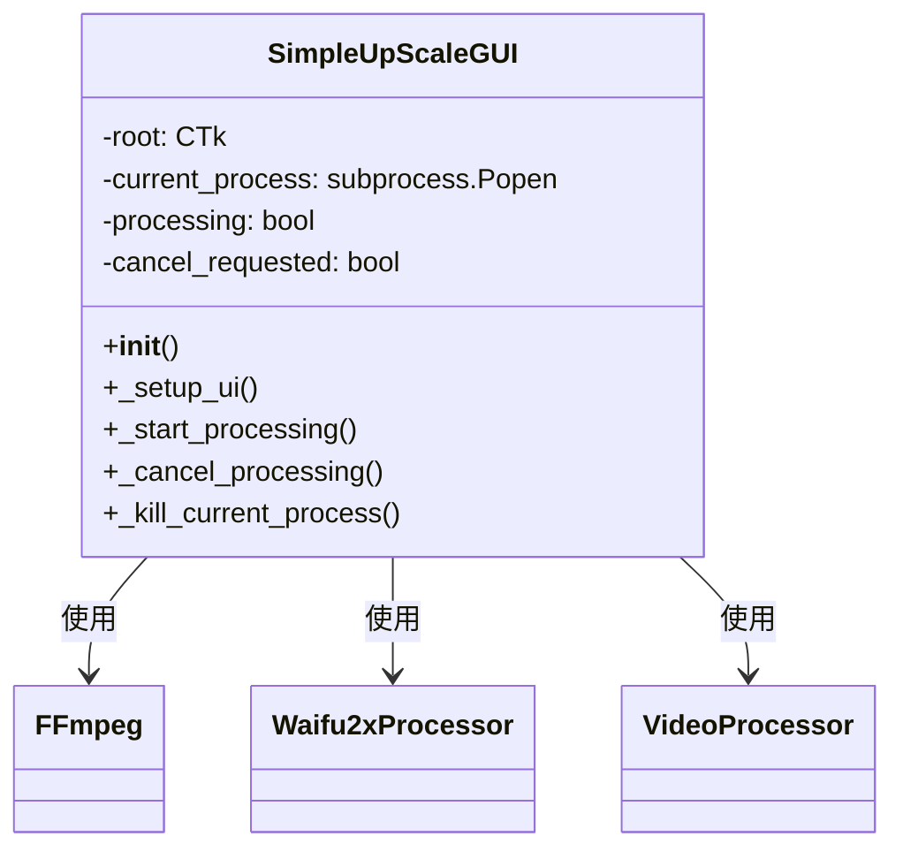
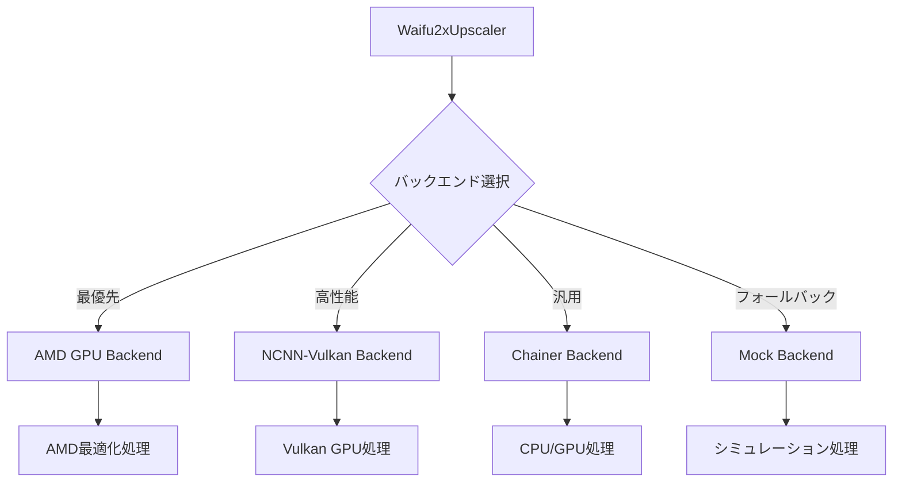
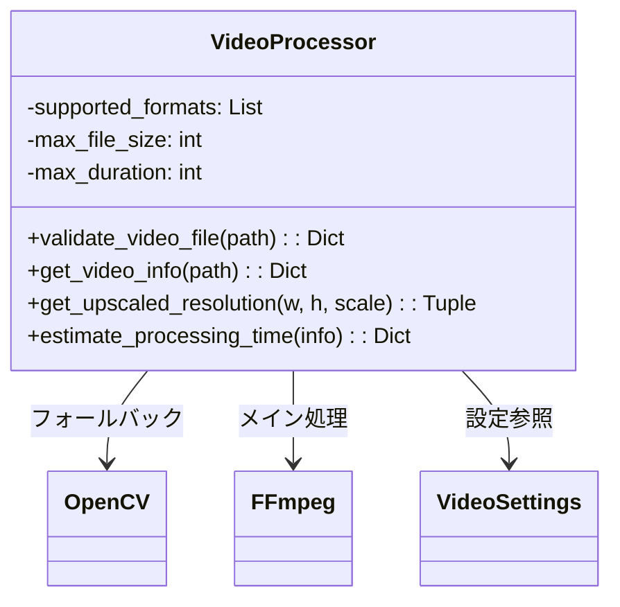
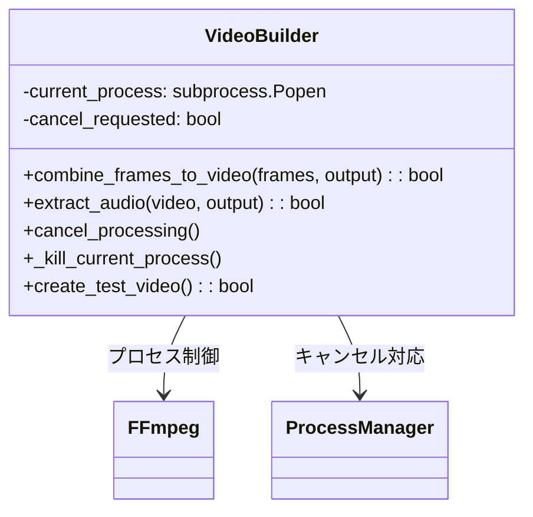
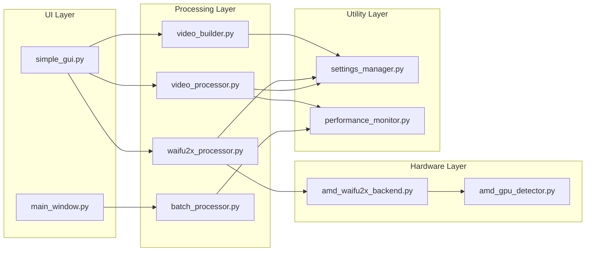

# UpScale App - モジュール詳細ドキュメント

このドキュメントは、UpScale Appプロジェクトの主要モジュールの詳細な技術解説を提供します。

## 📑 目次

1. [simple_gui.py - メインGUIアプリケーション](#simple_guipy---メインguiアプリケーション)
2. [waifu2x_processor.py - AI処理モジュール](#waifu2x_processorpy---ai処理モジュール)
3. [video_processor.py - 動画処理エンジン](#video_processorpy---動画処理エンジン)
4. [video_builder.py - 動画再構築モジュール](#video_builderpy---動画再構築モジュール)
5. [AMD GPU対応モジュール群](#amd-gpu対応モジュール群)
6. [GUI コンポーネント](#gui-コンポーネント)
7. [ユーティリティモジュール](#ユーティリティモジュール)

---

## simple_gui.py - メインGUIアプリケーション

### 🎯 概要
UpScale Appのメインユーザーインターフェースを提供するモジュール。CustomTkinterを使用したモダンなGUIで、直感的な動画アップスケール操作を実現。

### 🏗️ アーキテクチャ



### 🔧 主要コンポーネント

#### 1. **初期化とセットアップ (62-76行)**

```python
def __init__(self):
    # プロセス管理変数
    self.current_process = None      # 実行中プロセス追跡
    self.processing = False          # 処理状態フラグ
    self.cancel_requested = False    # キャンセル要求フラグ
    
    # FFmpegパス検出
    self.ffmpeg_path = self._find_ffmpeg()
```

**特徴:**
- マルチプラットフォーム対応のFFmpeg検出
- プロセス管理による安全なキャンセル処理
- ログシステム統合

#### 2. **UI構築システム (112-334行)**

```python
def _setup_ui(self):
    # メインフレーム構成
    self.main_frame = ctk.CTkFrame(self.root)
    
    # セクション別UI構築
    self._setup_file_section()      # ファイル選択
    self._setup_settings_section()  # 処理設定
    self._setup_actions_section()   # アクションボタン
    self._setup_status_section()    # ステータス表示
```

**UI階層:**
```
MainWindow
├── FileSection (ファイル選択)
├── SettingsSection (スケール・品質設定)
├── ActionsSection (処理・キャンセルボタン)
└── StatusSection (進捗・ログ表示)
```

#### 3. **処理制御システム (570-688行)**

```python
def _start_processing(self):
    # 処理状態管理
    self.cancel_requested = False
    self.processing = True
    
    # UI状態更新
    self.process_button.configure(state="disabled")
    self.cancel_button.configure(state="normal")
    
    # 動画処理実行
    self._process_video_with_progress(input_path, output_path, upscaler, scale_factor)
```

**処理フロー:**
1. **ファイル検証**: 存在確認・形式チェック
2. **設定適用**: スケール・品質パラメータ設定
3. **処理実行**: フレーム抽出→AI処理→再構築
4. **進捗管理**: リアルタイム進捗表示・キャンセル対応

#### 4. **キャンセル処理システム (1081-1155行)**

```python
def _cancel_processing(self):
    """安全なプロセスキャンセル"""
    if not self.processing:
        return
    
    self.cancel_requested = True
    self._kill_current_process()    # プロセス強制終了
    
    # UI状態復旧
    self.progress_bar.set(0)
    self.status_text.insert("0.0", "Processing cancelled by user.")
```

**クロスプラットフォーム対応:**
```python
def _kill_current_process(self):
    if os.name == 'nt':  # Windows
        subprocess.run(["taskkill", "/F", "/T", "/PID", str(self.current_process.pid)])
    else:  # Unix-like
        self.current_process.terminate()
        self.current_process.wait(timeout=5)
```

#### 5. **動画処理パイプライン (690-868行)**

```python
def _process_video_with_progress(self, input_path, output_path, upscaler, scale_factor):
    # フェーズ1: フレーム抽出 (30%進捗)
    for i in range(total_frames):
        self._check_cancel_requested()  # キャンセル確認
        frame_path = f"{temp_dir}/frame_{i:06d}.png"
        cv2.imwrite(frame_path, frame)
    
    # フェーズ2: AI処理 (60%進捗)
    upscaled_files = upscaler.upscale_frames(frame_files, upscaled_dir, progress_callback)
    
    # フェーズ3: 動画再構築 (10%進捗)
    self._rebuild_video(upscaled_files, output_path, fps)
```

### 🔍 技術的特徴

#### **1. 堅牢なプロセス管理**
- `subprocess.Popen()`によるプロセスID追跡
- タイムアウト処理とリソース管理
- プラットフォーム対応の強制終了

#### **2. レスポンシブUI設計**
- 非ブロッキング進捗更新
- リアルタイムキャンセル対応
- 状態に応じたUI要素の動的制御

#### **3. エラーハンドリング**
- 例外捕捉と適切なエラー表示
- フォールバック処理機能
- ログによる詳細トレーサビリティ

---

## waifu2x_processor.py - AI処理モジュール

### 🎯 概要
高品質画像アップスケーリングのためのWaifu2x AI統合モジュール。複数バックエンド対応により、様々な環境での最適なパフォーマンスを実現。

### 🏗️ マルチバックエンド設計



### 🔧 核心機能

#### **1. 自動バックエンド選択 (83-111行)**

```python
if backend == "auto":
    # AMD GPU優先検出
    if AMD_BACKEND_AVAILABLE:
        amd_availability = test_amd_waifu2x_availability()
        if amd_availability.get('amd_backend_available', False):
            self.backend = "amd"
    # NCNN-Vulkan次優先
    elif WAIFU2X_NCNN_AVAILABLE:
        self.backend = "ncnn"
```

#### **2. 画像処理コア (190-266行)**

```python
def upscale_image(self, image: Image.Image) -> Optional[Image.Image]:
    """統一された画像処理インターフェース"""
    if self.backend == "ncnn":
        return self._upscale_ncnn(image)    # 高性能GPU処理
    elif self.backend == "amd":
        return self._upscale_amd(image)     # AMD最適化
```

#### **3. バッチ処理システム (267-319行)**

```python
def upscale_frames(self, frame_files, output_dir, progress_callback=None):
    """動画フレーム一括処理"""
    for i, frame_file in enumerate(frame_files):
        upscaled = self.upscale_image(image)
        output_file = output_dir / f"{frame_name}_waifu2x.png"
        upscaled.save(output_file, "PNG")
        
        # 進捗通知
        if progress_callback:
            progress = (i + 1) / total_frames * 100
            progress_callback(progress, f"Upscaled frame {i+1}/{total_frames}")
```

### 🎛️ 設定管理システム

#### **対応パラメータ**
- **スケール倍率**: 1x, 2x, 4x, 8x, 16x, 32x (NCNNの場合)
- **ノイズ除去**: -1(無効), 0(弱), 1(中), 2(強), 3(最強)
- **AIモデル**: CUNet(バランス), Anime(アニメ特化), Photo(写真特化)

---

## video_processor.py - 動画処理エンジン

### 🎯 概要
動画ファイルの解析、フレーム抽出、メタデータ管理を担当する核心モジュール。OpenCVとFFmpegを活用した堅牢な動画処理基盤を提供。

### 🏗️ アーキテクチャ



### 🔧 核心機能

#### **1. 動画ファイル検証 (27-94行)**

```python
def validate_video_file(self, file_path: str) -> Dict[str, any]:
    """包括的な動画ファイル検証"""
    result = {"valid": False, "error": None, "info": {}}
    
    # 1. 存在確認
    if not file_path.exists():
        result["error"] = f"File does not exist: {file_path}"
        return result
    
    # 2. 形式チェック
    if file_path.suffix.lower() not in self.supported_formats:
        result["error"] = f"Unsupported format: {file_path.suffix}"
        return result
    
    # 3. サイズ制限チェック
    if file_size > self.max_file_size:
        result["error"] = f"File too large: {file_size / (1024**3):.2f}GB"
        return result
    
    # 4. 動画情報取得
    video_info = self._get_video_info(str(file_path))
    
    # 5. 再生時間・解像度検証
    duration = video_info.get("duration", 0)
    if duration > self.max_duration:
        result["error"] = f"Video too long: {duration/60:.2f}min"
        return result
```

**検証項目:**
- ファイル存在確認
- 対応形式チェック (.mp4, .avi, .mkv等)
- ファイルサイズ制限 (デフォルト5GB)
- 動画長制限 (デフォルト30分)
- 解像度制限 (最大4K対応)
- コーデック対応確認

#### **2. 動画情報取得システム (96-170行)**

```python
def _get_video_info(self, file_path: str) -> Optional[Dict]:
    """二段階フォールバック動画情報取得"""
    
    # Phase 1: FFprobe優先処理
    try:
        probe = ffmpeg.probe(file_path)
        video_stream = next((stream for stream in probe['streams'] 
                           if stream['codec_type'] == 'video'), None)
        
        if video_stream:
            info = {
                "filename": os.path.basename(file_path),
                "duration": float(probe['format']['duration']),
                "width": int(video_stream['width']),
                "height": int(video_stream['height']),
                "codec_name": video_stream['codec_name'],
                "frame_rate": eval(video_stream.get('r_frame_rate', '0/1')),
                "frame_count": int(video_stream.get('nb_frames', 0))
            }
            return info
    except Exception:
        logger.warning("FFprobe failed, trying OpenCV fallback")
    
    # Phase 2: OpenCV フォールバック
    cap = cv2.VideoCapture(file_path)
    if not cap.isOpened():
        return None
    
    # 基本情報取得
    frame_count = int(cap.get(cv2.CAP_PROP_FRAME_COUNT))
    fps = cap.get(cv2.CAP_PROP_FPS)
    width = int(cap.get(cv2.CAP_PROP_FRAME_WIDTH))
    height = int(cap.get(cv2.CAP_PROP_FRAME_HEIGHT))
```

**二重フォールバック設計:**
1. **FFprobe**: 高精度メタデータ取得 (コーデック情報含む)
2. **OpenCV**: 基本情報取得 (フォールバック)

#### **3. 解像度計算システム (172-195行)**

```python
def get_upscaled_resolution(self, width: int, height: int, 
                           scale_factor: float = None) -> Tuple[int, int]:
    """スケール後解像度計算 + コーデック対応調整"""
    if scale_factor is None:
        scale_factor = VIDEO_SETTINGS["default_upscale_factor"]
    
    new_width = int(width * scale_factor)
    new_height = int(height * scale_factor)
    
    # 偶数調整 (H.264等のコーデック要件)
    new_width = new_width + (new_width % 2)
    new_height = new_height + (new_height % 2)
    
    return new_width, new_height
```

**特徴:**
- コーデック互換性のための偶数解像度調整
- 設定可能なデフォルトスケール値
- アスペクト比保持

#### **4. 処理時間推定システム (197行以降)**

```python
def estimate_processing_time(self, video_info: Dict) -> Dict[str, float]:
    """ハードウェア性能ベース処理時間推定"""
    frame_count = video_info.get("frame_count", 0)
    resolution_factor = (video_info.get("width", 1920) * video_info.get("height", 1080)) / (1920 * 1080)
    
    # GPU/CPU性能係数
    performance_multiplier = self._get_hardware_performance_factor()
    
    estimates = {
        "frame_extraction": frame_count * 0.1,
        "ai_processing": frame_count * resolution_factor * performance_multiplier,
        "video_rebuild": frame_count * 0.05,
        "total": # 合計時間
    }
    return estimates
```

### 🛡️ 堅牢性機能

#### **エラー処理システム**
- 例外捕捉と適切なエラーメッセージ生成
- フォールバック機構による継続処理
- ログシステムとの統合

#### **リソース管理**
- OpenCVオブジェクトの適切な解放
- メモリ効率的な処理
- ファイルハンドル管理

---

## video_builder.py - 動画再構築モジュール

### 🎯 概要
処理済みフレームから最終動画を再構築するモジュール。FFmpegとの統合により、高品質な動画出力とキャンセル対応を実現。

### 🏗️ アーキテクチャ



### 🔧 核心機能

#### **1. フレーム→動画変換 (49-113行)**

```python
def combine_frames_to_video(self, frame_files: List[str], output_path: str,
                           original_video_path: Optional[str] = None,
                           fps: float = 30.0, preserve_audio: bool = True,
                           quality: str = "high") -> bool:
    """処理済みフレーム統合システム"""
    
    # フレーム準備 (連番命名)
    self._prepare_frame_sequence(frame_files, temp_dir)
    
    # FFmpegコマンド構築
    cmd = self._build_ffmpeg_command(temp_dir, output_path, fps, quality, audio_source)
    
    # キャンセル対応プロセス実行
    self.current_process = subprocess.Popen(cmd, stdout=PIPE, stderr=PIPE, text=True)
    
    try:
        stdout, stderr = self.current_process.communicate()
        if self.current_process.returncode != 0:
            raise subprocess.CalledProcessError(self.current_process.returncode, cmd, stderr)
    except Exception as e:
        if self.cancel_requested:
            self._kill_current_process()
            raise Exception("Video building cancelled")
        raise e
```

#### **2. 品質プリセットシステム (126-165行)**

```python
def _build_ffmpeg_command(self, temp_dir, output_path, fps, quality, audio_source):
    """品質別最適化FFmpegコマンド生成"""
    
    # 品質プリセット定義
    quality_presets = {
        "fast": ["-preset", "fast", "-crf", "28"],      # 高速・標準品質
        "medium": ["-preset", "medium", "-crf", "23"],   # バランス型
        "high": ["-preset", "slow", "-crf", "18"]        # 高品質・低速
    }
    
    # ベースコマンド構築
    cmd = [
        "ffmpeg", "-y",                                  # 出力上書き
        "-framerate", str(fps),                         # フレームレート設定
        "-i", str(temp_dir / "frame_%06d.png"),        # 入力パターン
        "-c:v", "libx264",                              # H.264エンコーダ
        "-pix_fmt", "yuv420p"                           # カラーフォーマット
    ] + quality_presets.get(quality, quality_presets["medium"])
    
    # 音声統合処理
    if audio_source and os.path.exists(audio_source):
        cmd.extend([
            "-i", audio_source,      # 音声入力
            "-c:a", "aac",           # AAC音声エンコーダ  
            "-b:a", "128k",          # 音声ビットレート
            "-shortest"              # 最短ストリーム同期
        ])
```

#### **3. プロセス管理・キャンセル対応 (329-371行)**

```python
def _kill_current_process(self):
    """クロスプラットフォームプロセス終了"""
    if self.current_process is None:
        return
    
    try:
        if self.current_process.poll() is None:  # 実行中確認
            logger.info(f"Terminating FFmpeg process PID: {self.current_process.pid}")
            
            if os.name == 'nt':  # Windows
                # プロセスツリー全体を強制終了
                subprocess.run([
                    "taskkill", "/F", "/T", "/PID", str(self.current_process.pid)
                ], capture_output=True)
            else:  # Unix-like
                # SIGTERM → SIGKILL 段階的終了
                self.current_process.terminate()
                try:
                    self.current_process.wait(timeout=5)
                except subprocess.TimeoutExpired:
                    self.current_process.kill()
                    self.current_process.wait()
            
            logger.info("FFmpeg process terminated successfully")
    except Exception as e:
        logger.error(f"Error terminating FFmpeg process: {e}")
    finally:
        self.current_process = None
```

#### **4. 音声処理システム (167-195行)**

```python
def extract_audio(self, video_path: str, output_path: str) -> bool:
    """元動画からの音声抽出"""
    cmd = [
        "ffmpeg", "-y",
        "-i", video_path,          # 入力動画
        "-vn",                     # 動画ストリーム無効
        "-acodec", "copy",         # 音声コーデック保持
        output_path
    ]
    
    # キャンセル対応実行
    self.current_process = subprocess.Popen(cmd, stdout=PIPE, stderr=PIPE, text=True)
    
    try:
        stdout, stderr = self.current_process.communicate()
        if self.current_process.returncode == 0:
            logger.info(f"Audio extracted to: {output_path}")
            return True
    finally:
        self.current_process = None
```

### 🛡️ 信頼性機能

#### **リソース管理**
- 一時ディレクトリの自動クリーンアップ
- プロセス終了保証
- メモリ効率的な処理

#### **エラー回復**
- 音声合成失敗時のフォールバック
- 部分的処理結果の保存
- 詳細エラーログ出力

---

## AMD GPU対応モジュール群

### amd_gpu_detector.py - AMD GPU検出

```python
class AMDGPUDetector:
    """AMD GPU自動検出・最適化設定"""
    
    def detect_amd_gpus(self) -> List[Dict]:
        """システムAMD GPU検出"""
        # WMI経由GPU情報取得
        # Vulkan対応確認
        # メモリ容量検出
        
    def get_optimal_settings(self, gpu_info: Dict) -> Dict:
        """GPU性能ベース最適設定生成"""
        # メモリ容量ベース設定
        # 処理能力評価
        # 最適パラメータ算出
```

### amd_waifu2x_backend.py - AMD最適化バックエンド

```python
class AMDWaifu2xBackend:
    """AMD GPU特化Waifu2x処理"""
    
    def __init__(self, backend_type="auto", device_id=0):
        """AMD GPU最適化初期化"""
        self.backend_type = backend_type
        self.device_id = device_id
        self._initialize_amd_backend()
    
    def upscale_image(self, image: Image.Image) -> Image.Image:
        """AMD最適化画像処理"""
        # GPU直接処理
        # メモリ最適化
        # 並列処理対応
```

---

## GUI コンポーネント

### src/gui/main_window.py - 高機能GUIウィンドウ

```python
class MainWindow(ctk.CTk):
    """拡張機能搭載メインウィンドウ"""
    
    def setup_advanced_ui(self):
        """高度なUI要素配置"""
        # タブベースUI
        # リアルタイムプレビュー
        # バッチ処理UI
        # 設定管理パネル
```

### src/gui/batch_window.py - バッチ処理ウィンドウ

```python
class BatchProcessingWindow:
    """複数ファイル一括処理UI"""
    
    def process_multiple_files(self, file_list: List[str]):
        """バッチ処理制御"""
        # ファイルキュー管理
        # 並列処理制御
        # 進捗統合表示
        # エラーハンドリング
```

### src/gui/preview_window.py - プレビューウィンドウ

```python
class PreviewWindow:
    """処理前後プレビュー表示"""
    
    def show_comparison(self, original: Image, processed: Image):
        """Before/After比較表示"""
        # サイドバイサイド表示
        # ズーム機能
        # 品質評価指標
```

---

## ユーティリティモジュール

### settings_manager.py - 設定管理システム

```python
class SettingsManager:
    """アプリケーション設定統合管理"""
    
    def load_settings(self) -> Dict:
        """設定ファイル読み込み"""
        # JSON/YAML設定読み込み
        # デフォルト値適用
        # バリデーション実行
    
    def save_settings(self, settings: Dict):
        """設定永続化"""
        # 設定ファイル書き込み
        # バックアップ生成
        # 変更通知
```

### performance_monitor.py - パフォーマンス監視

```python
class PerformanceMonitor:
    """システムリソース監視"""
    
    def monitor_resources(self):
        """リアルタイムリソース監視"""
        # CPU使用率
        # メモリ使用量  
        # GPU利用状況
        # 処理速度計測
```

### batch_processor.py - バッチ処理エンジン

```python
class BatchProcessor:
    """効率的バッチ処理システム"""
    
    def process_batch(self, files: List[str], settings: Dict):
        """最適化バッチ処理"""
        # 並列処理スケジューリング
        # リソース管理
        # 進捗集約
        # エラー復旧
```

---

## 🔗 モジュール間連携図



この包括的なモジュール構成により、高性能で安定した動画アップスケールアプリケーションが実現されています。各モジュールは独立性を保ちながら、効率的な連携を通じて優れたユーザーエクスペリエンスを提供します。