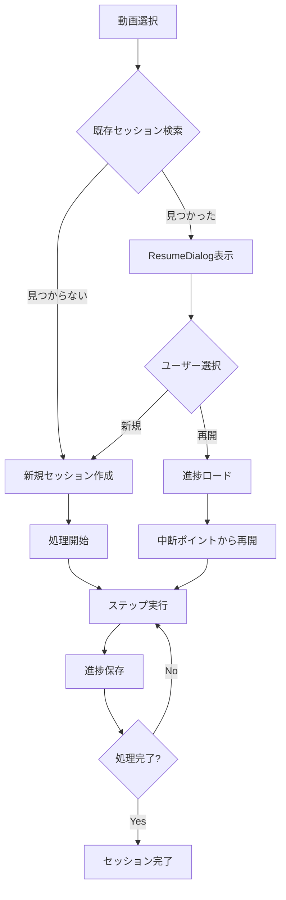

# UpScaleApp レジューム機能詳細設計書

## 1. 概要

### 1.1 目的
動画のアップスケール処理は時間がかかるため、処理中断時に前回の進捗から再開できるレジューム機能を提供する。

### 1.2 基本方針
- セッションベースの進捗管理
- ファイルベースの永続化
- 段階的処理の詳細追跡
- 自動復旧機能

## 2. システムアーキテクチャ

### 2.1 コンポーネント構成
```
┌─────────────────┐    ┌─────────────────┐    ┌─────────────────┐
│   MainGUI       │────│ SessionManager  │────│ ResumeDialog    │
│                 │    │                 │    │                 │
│ - process_video │    │ - create_session│    │ - show_sessions │
│ - resume_check  │    │ - save_progress │    │ - user_selection│
└─────────────────┘    │ - load_progress │    └─────────────────┘
                       │ - find_resumable│
                       └─────────────────┘
                                │
                       ┌─────────────────┐
                       │ File System     │
                       │                 │
                       │ /temp/sessions/ │
                       │ ├─ session_id/  │
                       │ │  ├─ progress.json│
                       │ │  ├─ frames/    │
                       │ │  ├─ upscaled/  │
                       │ │  └─ logs/      │
                       └─────────────────┘
```

### 2.2 処理フロー


## 3. データ構造設計

### 3.1 セッション識別子
```python
# セッションID生成ロジック
session_data = {
    'video_path': str(Path(video_path).resolve()),  # 絶対パス（正規化）
    'video_size': os.stat(video_path).st_size,      # ファイルサイズ
    'video_mtime': os.stat(video_path).st_mtime,    # 更新日時
    'scale_factor': float,                          # 拡大率
    'quality': str,                                 # 品質設定
    'noise_reduction': int                          # ノイズ除去レベル
}
session_id = hashlib.md5(json.dumps(session_data, sort_keys=True).encode()).hexdigest()
```

### 3.2 進捗データ構造
```json
{
    "session_id": "a1b2c3d4e5f6...",
    "video_file": "/path/to/video.mp4",
    "video_info": {
        "duration": 120.5,
        "frame_count": 3000,
        "fps": 24.97,
        "width": 1920,
        "height": 1080
    },
    "settings": {
        "scale_factor": 2.0,
        "quality": "Quality",
        "noise_reduction": 3,
        "backend": "real_cugan"
    },
    "created_at": "2024-08-24T10:30:00",
    "last_updated": "2024-08-24T10:45:00",
    "status": "in_progress",
    "steps": {
        "validate": {
            "status": "completed",
            "progress": 100,
            "start_time": "2024-08-24T10:30:00",
            "end_time": "2024-08-24T10:30:05",
            "error": null
        },
        "extract": {
            "status": "completed",
            "progress": 100,
            "total_frames": 3000,
            "extracted_frames": 3000,
            "completed_batches": [1, 2, 3, 4, 5],
            "start_time": "2024-08-24T10:30:05",
            "end_time": "2024-08-24T10:35:00",
            "error": null
        },
        "upscale": {
            "status": "in_progress",
            "progress": 45.5,
            "total_frames": 3000,
            "completed_frames": [
                "frame_0001.png",
                "frame_0002.png",
                "..."
            ],
            "failed_frames": [],
            "current_batch": 14,
            "start_time": "2024-08-24T10:35:00",
            "end_time": null,
            "error": null
        },
        "combine": {
            "status": "pending",
            "progress": 0,
            "output_path": null,
            "start_time": null,
            "end_time": null,
            "error": null
        }
    }
}
```

## 4. 処理ステップ仕様

### 4.1 ステップ定義
1. **validate** - 入力ファイル検証
2. **extract** - フレーム抽出
3. **upscale** - AI アップスケール
4. **combine** - 動画結合

### 4.2 ステータス値
- `pending`: 未開始
- `in_progress`: 実行中
- `completed`: 完了
- `failed`: 失敗
- `cancelled`: キャンセル

### 4.3 各ステップの詳細仕様

#### 4.3.1 validate ステップ
```python
# 実行内容
- 動画ファイルの存在確認
- ファイル形式検証
- メタデータ取得

# 成功時データ
{
    "status": "completed",
    "progress": 100,
    "file_size": 1024000,
    "codec": "h264",
    "validation_time": 0.5
}

# 失敗時データ
{
    "status": "failed",
    "error": "Invalid video format: unsupported codec"
}
```

#### 4.3.2 extract ステップ
```python
# 実行内容
- FFmpegによるフレーム抽出
- バッチ処理での効率化
- 抽出済みフレーム管理

# 進行中データ
{
    "status": "in_progress",
    "progress": 75.0,
    "total_frames": 3000,
    "extracted_frames": 2250,
    "completed_batches": [1, 2, 3, 4, 5, 6, 7, 8, 9],
    "current_batch": 10,
    "extraction_rate": 45.5  # frames/sec
}
```

#### 4.3.3 upscale ステップ
```python
# 実行内容
- フレーム単位のAI処理
- 並列処理による高速化
- 個別フレーム完了追跡

# 進行中データ
{
    "status": "in_progress",
    "progress": 60.3,
    "total_frames": 3000,
    "completed_frames": ["frame_0001.png", "frame_0002.png", ...],
    "failed_frames": ["frame_0456.png"],  # 失敗フレーム
    "processing_rate": 2.3,  # frames/sec
    "backend_used": "real_cugan"
}
```

#### 4.3.4 combine ステップ
```python
# 実行内容
- アップスケール済みフレームの動画結合
- FFmpegによる高品質エンコード
- 出力ファイル生成

# 完了時データ
{
    "status": "completed",
    "progress": 100,
    "output_path": "/output/upscaled_video.mp4",
    "output_size": 5120000,
    "encoding_time": 180.5
}
```

## 5. ファイルシステム構造

### 5.1 ディレクトリ構造
```
/temp/upscale_app_sessions/
└── {session_id}/
    ├── progress.json       # 進捗データ
    ├── session_info.json   # セッション基本情報
    ├── frames/             # 抽出フレーム
    │   ├── frame_0001.png
    │   ├── frame_0002.png
    │   └── ...
    ├── upscaled/           # アップスケール済みフレーム
    │   ├── frame_0001_upscaled.png
    │   ├── frame_0002_upscaled.png
    │   └── ...
    └── logs/               # 処理ログ
        ├── extract.log
        ├── upscale.log
        └── combine.log
```

### 5.2 ファイル命名規則
- セッションID: MD5ハッシュ（32文字）
- フレームファイル: `frame_{4桁連番}.png`
- アップスケールファイル: `frame_{4桁連番}_upscaled.png`
- ログファイル: `{ステップ名}.log`

## 6. レジューム判定ロジック

### 6.1 再開可能条件
```python
def is_resumable(progress_data):
    # 1. 7日以内のセッション
    if (datetime.now() - datetime.fromisoformat(progress_data['created_at'])).days > 7:
        return False
    
    # 2. 失敗やキャンセルでない
    if progress_data['status'] in ['failed', 'cancelled']:
        return False
    
    # 3. 少なくとも1つのステップが開始済み
    steps = progress_data['steps']
    started_steps = [s for s in steps.values() if s['status'] != 'pending']
    if not started_steps:
        return False
    
    # 4. 必要なファイルが存在
    return validate_session_files(progress_data['session_id'])

def validate_session_files(session_id):
    session_dir = get_session_dir(session_id)
    
    # 基本ディレクトリ存在確認
    if not session_dir.exists():
        return False
    
    # progress.jsonの整合性確認
    progress_file = session_dir / "progress.json"
    if not progress_file.exists():
        return False
    
    return True
```

### 6.2 自動復旧機能
```python
def auto_recovery_check(session_id):
    """
    ステータスは完了だが実際のファイルが存在しない場合の自動復旧
    """
    progress_data = load_progress(session_id)
    session_dir = get_session_dir(session_id)
    
    # フレーム抽出の整合性確認
    extract_status = progress_data['steps']['extract']['status']
    if extract_status == 'completed':
        frames_dir = session_dir / "frames"
        frame_files = list(frames_dir.glob("frame_*.png"))
        expected_count = progress_data['steps']['extract']['extracted_frames']
        
        if len(frame_files) != expected_count:
            logger.warning(f"Frame count mismatch: expected {expected_count}, found {len(frame_files)}")
            # ステータスをpendingにリセット
            update_step_status(session_id, 'extract', 'pending', 0)
    
    # アップスケールの整合性確認
    upscale_status = progress_data['steps']['upscale']['status']
    if upscale_status == 'completed':
        upscaled_dir = session_dir / "upscaled"
        upscaled_files = list(upscaled_dir.glob("*_upscaled.png"))
        expected_count = len(progress_data['steps']['upscale']['completed_frames'])
        
        if len(upscaled_files) != expected_count:
            logger.warning(f"Upscaled frame count mismatch: expected {expected_count}, found {len(upscaled_files)}")
            # ステータスをpendingにリセット
            update_step_status(session_id, 'upscale', 'pending', 0)
```

## 7. エラーハンドリング

### 7.1 エラー分類
1. **一時的エラー** - リトライ可能
   - ネットワークエラー
   - メモリ不足
   - 一時的なファイルアクセスエラー

2. **恒久的エラー** - セッション終了
   - ファイル破損
   - 設定エラー
   - サポートされていない形式

3. **ユーザーエラー** - 外部要因
   - 入力ファイル削除
   - 権限不足
   - ディスク容量不足

### 7.2 エラー処理フロー
```python
def handle_processing_error(session_id, step_name, error):
    error_type = classify_error(error)
    
    if error_type == 'temporary':
        # リトライ処理
        retry_count = get_retry_count(session_id, step_name)
        if retry_count < MAX_RETRIES:
            schedule_retry(session_id, step_name, delay=2**retry_count)
        else:
            mark_step_failed(session_id, step_name, "Max retries exceeded")
    
    elif error_type == 'permanent':
        # セッション終了
        mark_session_failed(session_id, str(error))
        cleanup_partial_files(session_id)
    
    elif error_type == 'user':
        # ユーザー通知と一時停止
        mark_step_paused(session_id, step_name, str(error))
        notify_user(f"処理を一時停止しました: {error}")
```

## 8. パフォーマンス最適化

### 8.1 I/O最適化
- 進捗保存の頻度制限（最大1秒に1回）
- バッチ書き込みによるディスクアクセス削減
- 非同期I/Oでのログ出力

### 8.2 メモリ最適化
- フレームリストの段階的読み込み
- 完了済みフレーム情報の圧縮
- 定期的なガベージコレクション

### 8.3 ストレージ最適化
- 古いセッションの自動削除
- 一時ファイルの定期クリーンアップ
- 圧縮による容量節約

## 9. セキュリティ考慮事項

### 9.1 ファイルアクセス制御
- セッションディレクトリの適切な権限設定
- パストラバーサル攻撃の防止
- 一時ファイルの安全な削除

### 9.2 データ保護
- 進捗データの整合性チェック
- セッションIDの推測困難性
- 機密情報のログ出力防止

## 10. 運用・保守

### 10.1 ログ設計
- 各ステップの詳細実行ログ
- エラーの詳細情報とスタックトレース
- パフォーマンス指標の記録

### 10.2 監視項目
- セッション数の推移
- 失敗率の監視
- ディスク使用量の監視
- 平均処理時間の追跡

### 10.3 メンテナンス機能
- 古いセッションの一括削除
- 破損セッションの修復
- 統計情報の生成

---

## 変更履歴
- v1.0: 初版作成 (2024-08-24)