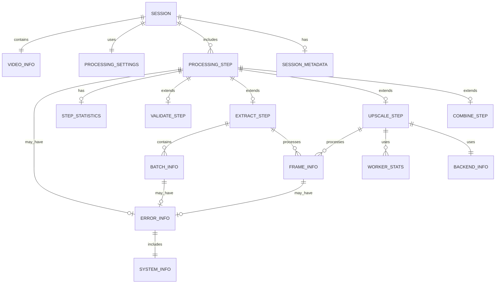

# UpScaleApp レジューム機能 ER図

## 1. 概要

### 1.1 目的
UpScaleAppのレジューム機能におけるデータエンティティ間の関係を視覚化し、データベース的な観点からシステムの設計を明確化する。

### 1.2 記法
- **エンティティ**: 四角形で表現
- **関係**: 菱形で表現  
- **属性**: 楕円で表現
- **主キー**: アンダーライン付き
- **外部キー**: 破線アンダーライン付き

## 2. 主要エンティティ

### 2.1 Session エンティティ
セッション情報の中核エンティティ

```
┌─────────────────────────────────────┐
│              SESSION                │
├─────────────────────────────────────┤
│ + session_id: VARCHAR(32) [PK]      │
│ + video_file: TEXT                  │
│ + created_at: DATETIME              │
│ + last_updated: DATETIME            │
│ + status: ENUM                      │
│ - video_info_id: VARCHAR(32) [FK]   │
│ - settings_id: VARCHAR(32) [FK]     │
│ - metadata_id: VARCHAR(32) [FK]     │
└─────────────────────────────────────┘
```

### 2.2 VideoInfo エンティティ
動画ファイルのメタデータ

```
┌─────────────────────────────────────┐
│             VIDEO_INFO              │
├─────────────────────────────────────┤
│ + info_id: VARCHAR(32) [PK]         │
│ + file_path: TEXT                   │
│ + file_size: BIGINT                 │
│ + file_modified: BIGINT             │
│ + duration: DECIMAL                 │
│ + frame_count: INTEGER              │
│ + fps: DECIMAL                      │
│ + width: INTEGER                    │
│ + height: INTEGER                   │
│ + video_codec: VARCHAR(50)          │
│ + audio_codec: VARCHAR(50)          │
│ + bitrate: INTEGER                  │
│ + format: VARCHAR(20)               │
│ + has_audio: BOOLEAN                │
│ + color_space: VARCHAR(50)          │
│ + aspect_ratio: VARCHAR(20)         │
└─────────────────────────────────────┘
```

### 2.3 ProcessingSettings エンティティ
処理設定パラメータ

```
┌─────────────────────────────────────┐
│          PROCESSING_SETTINGS        │
├─────────────────────────────────────┤
│ + settings_id: VARCHAR(32) [PK]     │
│ + scale_factor: DECIMAL             │
│ + quality: ENUM                     │
│ + noise_reduction: INTEGER          │
│ + backend: ENUM                     │
│ + backend_version: VARCHAR(20)      │
│ + parallel_processing: BOOLEAN      │
│ + gpu_acceleration: BOOLEAN         │
│ + max_threads: INTEGER              │
│ + batch_size: INTEGER               │
│ + output_format: VARCHAR(10)        │
│ + output_quality: INTEGER           │
│ + preserve_audio: BOOLEAN           │
│ + frame_format: VARCHAR(10)         │
│ + temp_compression: BOOLEAN         │
└─────────────────────────────────────┘
```

### 2.4 ProcessingStep エンティティ（抽象）
処理ステップの基底エンティティ

```
┌─────────────────────────────────────┐
│           PROCESSING_STEP           │
├─────────────────────────────────────┤
│ + step_id: VARCHAR(32) [PK]         │
│ - session_id: VARCHAR(32) [FK]      │
│ + step_name: ENUM                   │
│ + status: ENUM                      │
│ + progress: DECIMAL                 │
│ + start_time: DATETIME              │
│ + end_time: DATETIME                │
│ + duration: DECIMAL                 │
│ + retry_count: INTEGER              │
│ - error_id: VARCHAR(32) [FK]        │
│ - statistics_id: VARCHAR(32) [FK]   │
└─────────────────────────────────────┘
```

### 2.5 ValidateStep エンティティ
検証ステップ詳細

```
┌─────────────────────────────────────┐
│            VALIDATE_STEP            │
├─────────────────────────────────────┤
│ + validate_id: VARCHAR(32) [PK]     │
│ - step_id: VARCHAR(32) [FK]         │
│ + file_exists: BOOLEAN              │
│ + file_readable: BOOLEAN            │
│ + format_supported: BOOLEAN         │
│ + metadata_valid: BOOLEAN           │
│ + estimated_processing_time: DECIMAL│
│ + estimated_output_size: BIGINT     │
│ - format_analysis_id: VARCHAR(32)   │
│ - compatibility_check_id: VARCHAR(32)│
└─────────────────────────────────────┘
```

### 2.6 ExtractStep エンティティ
フレーム抽出ステップ詳細

```
┌─────────────────────────────────────┐
│            EXTRACT_STEP             │
├─────────────────────────────────────┤
│ + extract_id: VARCHAR(32) [PK]      │
│ - step_id: VARCHAR(32) [FK]         │
│ + total_frames: INTEGER             │
│ + extracted_frames: INTEGER         │
│ + failed_extractions: INTEGER       │
│ + batch_size: INTEGER               │
│ + total_batches: INTEGER            │
│ + current_batch: INTEGER            │
│ + extraction_rate: DECIMAL          │
│ + average_frame_size: BIGINT        │
│ + total_extracted_size: BIGINT      │
└─────────────────────────────────────┘
```

### 2.7 UpscaleStep エンティティ
アップスケールステップ詳細

```
┌─────────────────────────────────────┐
│            UPSCALE_STEP             │
├─────────────────────────────────────┤
│ + upscale_id: VARCHAR(32) [PK]      │
│ - step_id: VARCHAR(32) [FK]         │
│ + total_frames: INTEGER             │
│ + worker_count: INTEGER             │
│ + active_workers: INTEGER           │
│ + processing_rate: DECIMAL          │
│ + average_processing_time: DECIMAL  │
│ + gpu_utilization: DECIMAL          │
│ + peak_memory_mb: INTEGER           │
│ + current_memory_mb: INTEGER        │
│ + memory_efficiency: DECIMAL        │
│ + gc_collections: INTEGER           │
│ - backend_info_id: VARCHAR(32) [FK] │
└─────────────────────────────────────┘
```

### 2.8 CombineStep エンティティ
動画結合ステップ詳細

```
┌─────────────────────────────────────┐
│            COMBINE_STEP             │
├─────────────────────────────────────┤
│ + combine_id: VARCHAR(32) [PK]      │
│ - step_id: VARCHAR(32) [FK]         │
│ + output_path: TEXT                 │
│ + output_size: BIGINT               │
│ + output_duration: DECIMAL          │
│ + encoder_used: VARCHAR(50)         │
│ + encoding_preset: VARCHAR(50)      │
│ + bitrate_target: INTEGER           │
│ + bitrate_actual: INTEGER           │
│ + encoding_speed: DECIMAL           │
│ + compression_ratio: DECIMAL        │
│ - audio_processing_id: VARCHAR(32)  │
│ - quality_metrics_id: VARCHAR(32)   │
└─────────────────────────────────────┘
```

## 3. 関連エンティティ

### 3.1 ErrorInfo エンティティ
エラー情報管理

```
┌─────────────────────────────────────┐
│             ERROR_INFO              │
├─────────────────────────────────────┤
│ + error_id: VARCHAR(32) [PK]        │
│ + error_code: VARCHAR(50)           │
│ + error_message: TEXT               │
│ + error_type: ENUM                  │
│ + timestamp: DATETIME               │
│ + step_name: VARCHAR(50)            │
│ + frame_context: TEXT               │
│ + stack_trace: TEXT                 │
│ + recoverable: BOOLEAN              │
│ + suggested_action: TEXT            │
│ + retry_after: INTEGER              │
│ - system_info_id: VARCHAR(32) [FK]  │
└─────────────────────────────────────┘
```

### 3.2 FrameInfo エンティティ
フレーム単位の処理情報

```
┌─────────────────────────────────────┐
│             FRAME_INFO              │
├─────────────────────────────────────┤
│ + frame_id: VARCHAR(32) [PK]        │
│ - session_id: VARCHAR(32) [FK]      │
│ + frame_path: TEXT                  │
│ + frame_number: INTEGER             │
│ + status: ENUM                      │
│ + file_size: INTEGER                │
│ + processing_time: DECIMAL          │
│ + retry_count: INTEGER              │
│ + last_processed: DATETIME          │
│ + quality_score: DECIMAL            │
│ - error_id: VARCHAR(32) [FK]        │
└─────────────────────────────────────┘
```

### 3.3 BatchInfo エンティティ
バッチ処理管理

```
┌─────────────────────────────────────┐
│             BATCH_INFO              │
├─────────────────────────────────────┤
│ + batch_id: VARCHAR(32) [PK]        │
│ - extract_step_id: VARCHAR(32) [FK] │
│ + batch_number: INTEGER             │
│ + status: ENUM                      │
│ + frame_count: INTEGER              │
│ + start_frame: INTEGER              │
│ + end_frame: INTEGER                │
│ + processing_time: DECIMAL          │
│ + success_rate: DECIMAL             │
│ - error_id: VARCHAR(32) [FK]        │
└─────────────────────────────────────┘
```

### 3.4 WorkerStats エンティティ
ワーカー統計情報

```
┌─────────────────────────────────────┐
│            WORKER_STATS             │
├─────────────────────────────────────┤
│ + worker_id: VARCHAR(32) [PK]       │
│ - upscale_step_id: VARCHAR(32) [FK] │
│ + worker_number: INTEGER            │
│ + processed_frames: INTEGER         │
│ + processing_time: DECIMAL          │
│ + average_time_per_frame: DECIMAL   │
│ + error_count: INTEGER              │
│ + current_frame: TEXT               │
│ + status: ENUM                      │
│ + started_at: DATETIME              │
│ + last_activity: DATETIME           │
└─────────────────────────────────────┘
```

## 4. ER図表現

### 4.1 主要関係図


### 4.2 詳細関係定義

#### 4.2.1 Session - VideoInfo (1:1)
- **関係名**: contains
- **カーディナリティ**: 1対1
- **制約**: SessionはVideoInfoを必須で持つ

#### 4.2.2 Session - ProcessingStep (1:N)
- **関係名**: includes
- **カーディナリティ**: 1対多
- **制約**: Sessionは複数のProcessingStepを持つ（validate, extract, upscale, combine）

#### 4.2.3 ProcessingStep - FrameInfo (1:N)
- **関係名**: processes
- **カーディナリティ**: 1対多
- **制約**: ExtractStep、UpscaleStepは複数のFrameInfoを持つ

#### 4.2.4 UpscaleStep - WorkerStats (1:N)
- **関係名**: uses
- **カーディナリティ**: 1対多
- **制約**: UpscaleStepは並列処理での複数WorkerStatsを持つ

## 5. インデックス設計

### 5.1 主要インデックス
```sql
-- セッション検索用
CREATE INDEX idx_session_video_file ON SESSION (video_file);
CREATE INDEX idx_session_status ON SESSION (status);
CREATE INDEX idx_session_created_at ON SESSION (created_at);

-- ステップ検索用  
CREATE INDEX idx_step_session_id ON PROCESSING_STEP (session_id);
CREATE INDEX idx_step_status ON PROCESSING_STEP (status);

-- フレーム検索用
CREATE INDEX idx_frame_session_id ON FRAME_INFO (session_id);
CREATE INDEX idx_frame_status ON FRAME_INFO (status);
CREATE INDEX idx_frame_number ON FRAME_INFO (frame_number);

-- バッチ検索用
CREATE INDEX idx_batch_extract_id ON BATCH_INFO (extract_step_id);
CREATE INDEX idx_batch_number ON BATCH_INFO (batch_number);

-- エラー検索用
CREATE INDEX idx_error_timestamp ON ERROR_INFO (timestamp);
CREATE INDEX idx_error_type ON ERROR_INFO (error_type);
```

### 5.2 複合インデックス
```sql
-- セッション + ステータス検索
CREATE INDEX idx_session_status_updated ON SESSION (status, last_updated);

-- フレーム + セッション + ステータス
CREATE INDEX idx_frame_session_status ON FRAME_INFO (session_id, status);

-- エラー + ステップ + 時刻
CREATE INDEX idx_error_step_time ON ERROR_INFO (step_name, timestamp);
```

## 6. データ整合性制約

### 6.1 参照整合性制約
```sql
-- Session → VideoInfo
ALTER TABLE SESSION 
ADD CONSTRAINT fk_session_video_info 
FOREIGN KEY (video_info_id) REFERENCES VIDEO_INFO (info_id)
ON DELETE CASCADE ON UPDATE CASCADE;

-- ProcessingStep → Session
ALTER TABLE PROCESSING_STEP 
ADD CONSTRAINT fk_step_session 
FOREIGN KEY (session_id) REFERENCES SESSION (session_id)
ON DELETE CASCADE ON UPDATE CASCADE;

-- FrameInfo → Session
ALTER TABLE FRAME_INFO 
ADD CONSTRAINT fk_frame_session 
FOREIGN KEY (session_id) REFERENCES SESSION (session_id)
ON DELETE CASCADE ON UPDATE CASCADE;
```

### 6.2 チェック制約
```sql
-- 進捗率は0-100の範囲
ALTER TABLE PROCESSING_STEP 
ADD CONSTRAINT chk_progress_range 
CHECK (progress >= 0 AND progress <= 100);

-- スケールファクターは正の値
ALTER TABLE PROCESSING_SETTINGS 
ADD CONSTRAINT chk_scale_factor_positive 
CHECK (scale_factor > 0);

-- フレーム番号は正の値
ALTER TABLE FRAME_INFO 
ADD CONSTRAINT chk_frame_number_positive 
CHECK (frame_number > 0);
```

### 6.3 一意制約
```sql
-- セッション内でのステップ名の一意性
ALTER TABLE PROCESSING_STEP 
ADD CONSTRAINT uk_session_step_name 
UNIQUE (session_id, step_name);

-- セッション内でのフレーム番号の一意性
ALTER TABLE FRAME_INFO 
ADD CONSTRAINT uk_session_frame_number 
UNIQUE (session_id, frame_number);
```

## 7. ビュー定義

### 7.1 セッション概要ビュー
```sql
CREATE VIEW session_summary AS
SELECT 
    s.session_id,
    s.video_file,
    s.status,
    s.created_at,
    s.last_updated,
    vi.duration,
    vi.frame_count,
    ps.scale_factor,
    ps.backend,
    -- 進捗計算
    AVG(step.progress) as overall_progress,
    -- アクティブステップ
    (SELECT step_name FROM PROCESSING_STEP 
     WHERE session_id = s.session_id AND status = 'in_progress' 
     LIMIT 1) as current_step
FROM SESSION s
JOIN VIDEO_INFO vi ON s.video_info_id = vi.info_id
JOIN PROCESSING_SETTINGS ps ON s.settings_id = ps.settings_id
LEFT JOIN PROCESSING_STEP step ON s.session_id = step.session_id
GROUP BY s.session_id;
```

### 7.2 フレーム処理状況ビュー
```sql
CREATE VIEW frame_processing_status AS
SELECT 
    fi.session_id,
    COUNT(*) as total_frames,
    COUNT(CASE WHEN fi.status = 'completed' THEN 1 END) as completed_frames,
    COUNT(CASE WHEN fi.status = 'failed' THEN 1 END) as failed_frames,
    COUNT(CASE WHEN fi.status = 'in_progress' THEN 1 END) as processing_frames,
    AVG(fi.processing_time) as avg_processing_time,
    AVG(fi.quality_score) as avg_quality_score
FROM FRAME_INFO fi
GROUP BY fi.session_id;
```

### 7.3 エラー統計ビュー
```sql
CREATE VIEW error_statistics AS
SELECT 
    ei.step_name,
    ei.error_type,
    COUNT(*) as error_count,
    COUNT(CASE WHEN ei.recoverable = true THEN 1 END) as recoverable_errors,
    AVG(CASE WHEN ei.retry_after > 0 THEN ei.retry_after END) as avg_retry_time
FROM ERROR_INFO ei
WHERE ei.timestamp >= DATE_SUB(NOW(), INTERVAL 30 DAY)
GROUP BY ei.step_name, ei.error_type
ORDER BY error_count DESC;
```

---

## 8. データマイグレーション

### 8.1 スキーマバージョン管理
```sql
CREATE TABLE schema_version (
    version VARCHAR(10) PRIMARY KEY,
    applied_at DATETIME NOT NULL,
    description TEXT
);

INSERT INTO schema_version VALUES 
('1.0', NOW(), 'Initial schema'),
('1.1', NOW(), 'Added statistics tables'),
('1.2', NOW(), 'Enhanced error handling');
```

### 8.2 マイグレーションスクリプト例
```sql
-- v1.0 → v1.1 マイグレーション
ALTER TABLE PROCESSING_STEP 
ADD COLUMN statistics_id VARCHAR(32);

CREATE TABLE STEP_STATISTICS (
    statistics_id VARCHAR(32) PRIMARY KEY,
    min_processing_time DECIMAL,
    max_processing_time DECIMAL,
    avg_processing_time DECIMAL,
    std_dev_processing_time DECIMAL,
    throughput_items_per_second DECIMAL,
    error_rate DECIMAL,
    retry_success_rate DECIMAL
);
```

---

## 変更履歴
- v1.0: 初版作成 (2024-08-24)
- v1.1: インデックス・制約設計追加
- v1.2: ビュー定義・マイグレーション追加