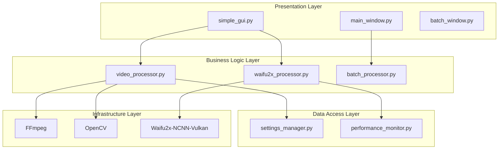
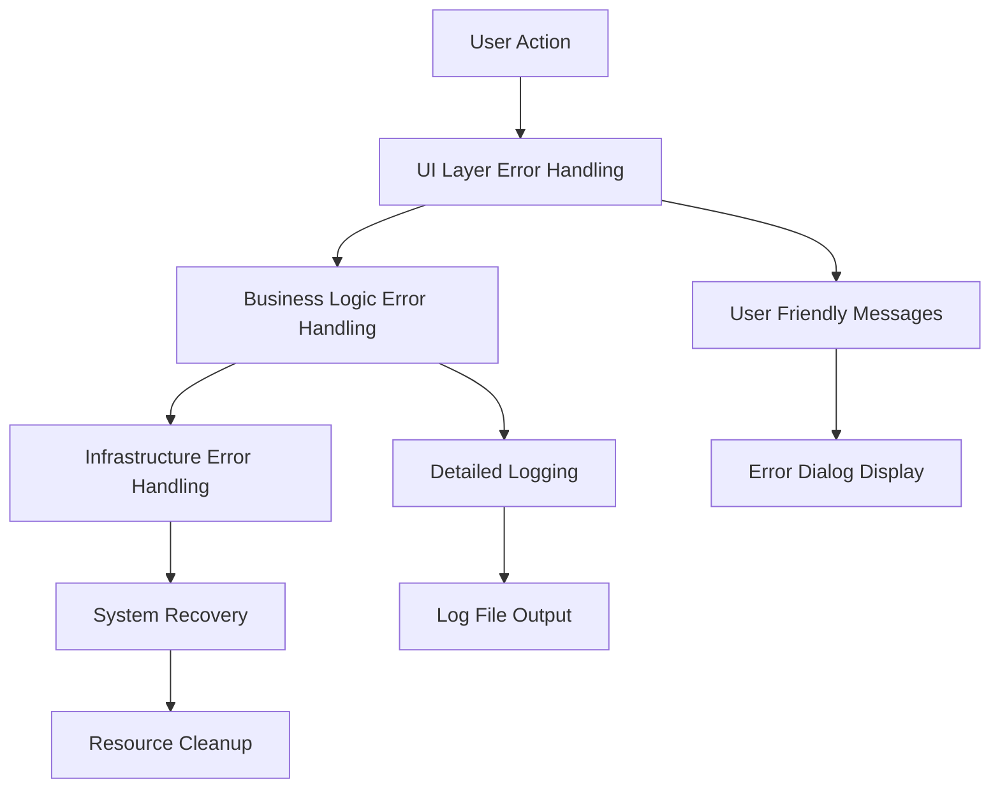

# UpScale App - 技術リファレンス

このドキュメントは、UpScale Appプロジェクトの技術的な実装詳細、設計パターン、および開発者向けガイドラインをまとめています。

## 📋 目次

1. [アーキテクチャ設計パターン](#アーキテクチャ設計パターン)
2. [エラーハンドリング戦略](#エラーハンドリング戦略)
3. [パフォーマンス最適化](#パフォーマンス最適化)
4. [セキュリティ考慮事項](#セキュリティ考慮事項)
5. [テスト戦略](#テスト戦略)
6. [デプロイメント・配布](#デプロイメント配布)

---

## アーキテクチャ設計パターン

### 🏗️ レイヤードアーキテクチャ



### 🔄 設計パターンの実装

#### 1. **Factory Pattern (Waifu2x Backend)**

```python
# waifu2x_processor.py
def create_waifu2x_upscaler(**kwargs) -> Waifu2xUpscaler:
    """Factory pattern for backend creation"""
    return Waifu2xUpscaler(**kwargs)

class Waifu2xUpscaler:
    def _initialize_backend(self):
        """Strategy pattern for backend selection"""
        if self.backend == "amd":
            self._initialize_amd()
        elif self.backend == "ncnn":
            self._initialize_ncnn()
        # ...
```

#### 2. **Observer Pattern (Progress Callbacks)**

```python
# simple_gui.py
def _process_video_with_progress(self, ...):
    def progress_callback(progress, message):
        # Observer pattern implementation
        self.progress_bar.set(progress)
        self.progress_label.configure(text=f"Progress: {message}")
        self.root.update()
    
    # Publisher notifies observer
    upscaler.upscale_frames(frame_files, upscaled_dir, progress_callback)
```

#### 3. **Command Pattern (Process Management)**

```python
# video_builder.py
class VideoBuilder:
    def cancel_processing(self):
        """Command pattern for cancellation"""
        self.cancel_requested = True
        self._kill_current_process()
    
    def _kill_current_process(self):
        """Encapsulated command execution"""
        if os.name == 'nt':
            subprocess.run(["taskkill", "/F", "/T", "/PID", str(self.current_process.pid)])
```

#### 4. **Template Method Pattern (File Processing)**

```python
# Base template for file processing
def process_video_template(self, input_path, output_path):
    """Template method pattern"""
    # 1. Validation (implemented by subclasses)
    self.validate_input(input_path)
    
    # 2. Processing (implemented by subclasses)
    self.extract_frames(input_path)
    self.process_frames()
    self.rebuild_video(output_path)
    
    # 3. Cleanup (common implementation)
    self.cleanup_temp_files()
```

---

## エラーハンドリング戦略

### 🛡️ 階層的エラー処理



### 🔧 実装パターン

#### 1. **Try-Catch-Finally パターン**

```python
def process_video_safe(self, input_path, output_path):
    """Comprehensive error handling"""
    try:
        # Reset state
        self.cancel_requested = False
        self.processing = True
        
        # Main processing
        result = self._process_video_with_progress(input_path, output_path, upscaler, scale_factor)
        return result
        
    except ProcessCancelledException:
        # User cancellation - expected exception
        self.logger.info("Processing cancelled by user")
        self._show_cancellation_message()
        return {"success": False, "reason": "cancelled"}
        
    except FileNotFoundError as e:
        # File system errors
        self.logger.error(f"File not found: {e}")
        self._show_error_dialog("File not found", str(e))
        return {"success": False, "reason": "file_not_found"}
        
    except subprocess.TimeoutExpired:
        # Process timeout
        self.logger.error("Process timeout - killing subprocess")
        self._kill_current_process()
        return {"success": False, "reason": "timeout"}
        
    except Exception as e:
        # Unexpected errors
        self.logger.exception("Unexpected error during processing")
        self._show_error_dialog("Processing Error", f"An unexpected error occurred: {str(e)}")
        return {"success": False, "reason": "unexpected_error"}
        
    finally:
        # Always executed - cleanup
        self.processing = False
        self.current_process = None
        self._reset_ui_state()
        self.logger.info("Processing session ended")
```

#### 2. **Context Manager パターン**

```python
class ProcessManager:
    """Context manager for process lifecycle"""
    
    def __init__(self, cmd, timeout=None):
        self.cmd = cmd
        self.timeout = timeout
        self.process = None
        
    def __enter__(self):
        self.process = subprocess.Popen(
            self.cmd, 
            stdout=subprocess.PIPE, 
            stderr=subprocess.PIPE,
            text=True
        )
        return self.process
        
    def __exit__(self, exc_type, exc_val, exc_tb):
        if self.process:
            try:
                if self.process.poll() is None:  # Still running
                    self.process.terminate()
                    self.process.wait(timeout=5)
            except subprocess.TimeoutExpired:
                self.process.kill()
                self.process.wait()
            finally:
                self.process = None

# Usage
def run_ffmpeg_safely(cmd):
    """Safe FFmpeg execution with automatic cleanup"""
    try:
        with ProcessManager(cmd, timeout=300) as process:
            stdout, stderr = process.communicate()
            if process.returncode != 0:
                raise subprocess.CalledProcessError(process.returncode, cmd, stderr)
            return stdout
    except Exception as e:
        logger.error(f"FFmpeg execution failed: {e}")
        raise
```

#### 3. **Error Recovery パターン**

```python
class RecoverableProcessor:
    """Error recovery with multiple fallback strategies"""
    
    def process_with_fallback(self, input_path):
        """Multi-level fallback processing"""
        
        # Strategy 1: High-quality AI processing
        try:
            return self._process_with_waifu2x(input_path)
        except Exception as e:
            self.logger.warning(f"Waifu2x processing failed: {e}, falling back to simple upscaling")
        
        # Strategy 2: Simple upscaling fallback
        try:
            return self._process_with_simple_upscaling(input_path)
        except Exception as e:
            self.logger.warning(f"Simple upscaling failed: {e}, falling back to copy")
        
        # Strategy 3: Last resort - copy original
        try:
            return self._copy_original_with_metadata_update(input_path)
        except Exception as e:
            self.logger.error(f"All processing strategies failed: {e}")
            raise ProcessingFailedException("All recovery strategies exhausted")
```

---

## パフォーマンス最適化

### 🚀 最適化戦略

#### 1. **メモリ管理最適化**

```python
class MemoryOptimizedProcessor:
    """Memory-efficient frame processing"""
    
    def __init__(self, max_memory_gb=4.0):
        self.max_memory_gb = max_memory_gb
        self.frame_batch_size = self._calculate_optimal_batch_size()
    
    def _calculate_optimal_batch_size(self):
        """Calculate optimal batch size based on available memory"""
        available_memory = psutil.virtual_memory().available / (1024**3)  # GB
        safe_memory = min(available_memory * 0.7, self.max_memory_gb)
        
        # Estimate memory per frame (assuming 1920x1080 RGB)
        memory_per_frame = (1920 * 1080 * 3 * 4) / (1024**3)  # 4 bytes per channel in float32
        
        batch_size = int(safe_memory / memory_per_frame)
        return max(1, min(batch_size, 10))  # Limit between 1-10 frames
    
    def process_frames_batch(self, frame_files):
        """Batch processing with memory management"""
        total_frames = len(frame_files)
        results = []
        
        for i in range(0, total_frames, self.frame_batch_size):
            batch = frame_files[i:i + self.frame_batch_size]
            
            # Process batch
            batch_results = []
            for frame_file in batch:
                with Image.open(frame_file) as img:
                    processed = self.upscale_image(img)
                    batch_results.append(processed)
                    
                # Force garbage collection after each frame
                del img
                gc.collect()
            
            results.extend(batch_results)
            
            # Update progress
            progress = (i + len(batch)) / total_frames * 100
            self.progress_callback(progress, f"Processed {i + len(batch)}/{total_frames} frames")
            
            # Check cancellation
            if self.cancel_requested:
                break
                
        return results
```

#### 2. **並列処理最適化**

```python
class ParallelProcessor:
    """Multi-threaded frame processing"""
    
    def __init__(self, max_workers=None):
        self.max_workers = max_workers or min(4, os.cpu_count())
        self.executor = None
    
    def process_frames_parallel(self, frame_files):
        """Parallel frame processing with thread pool"""
        from concurrent.futures import ThreadPoolExecutor, as_completed
        
        results = [None] * len(frame_files)
        
        with ThreadPoolExecutor(max_workers=self.max_workers) as executor:
            # Submit all tasks
            future_to_index = {
                executor.submit(self._process_single_frame, frame_file): i 
                for i, frame_file in enumerate(frame_files)
            }
            
            # Collect results as they complete
            completed = 0
            for future in as_completed(future_to_index):
                if self.cancel_requested:
                    # Cancel remaining tasks
                    for f in future_to_index:
                        f.cancel()
                    break
                    
                index = future_to_index[future]
                try:
                    results[index] = future.result()
                    completed += 1
                    
                    # Update progress
                    progress = completed / len(frame_files) * 100
                    self.progress_callback(progress, f"Completed {completed}/{len(frame_files)} frames")
                    
                except Exception as e:
                    self.logger.error(f"Frame {index} processing failed: {e}")
                    results[index] = None
        
        # Filter out failed results
        return [r for r in results if r is not None]
    
    def _process_single_frame(self, frame_file):
        """Thread-safe single frame processing"""
        try:
            with Image.open(frame_file) as img:
                return self.upscale_image(img)
        except Exception as e:
            self.logger.error(f"Failed to process {frame_file}: {e}")
            return None
```

#### 3. **GPU最適化**

```python
class GPUOptimizedProcessor:
    """GPU-optimized processing with batching"""
    
    def __init__(self, gpu_id=0, batch_size=4):
        self.gpu_id = gpu_id
        self.batch_size = batch_size
        self.gpu_memory_limit = self._detect_gpu_memory()
    
    def _detect_gpu_memory(self):
        """Detect available GPU memory"""
        try:
            # For NVIDIA GPUs
            import nvidia_ml_py3 as nvml
            nvml.nvmlInit()
            handle = nvml.nvmlDeviceGetHandleByIndex(self.gpu_id)
            info = nvml.nvmlDeviceGetMemoryInfo(handle)
            return info.free / (1024**3)  # GB
        except:
            # For AMD or unknown GPUs
            return 4.0  # Conservative estimate
    
    def optimize_batch_size(self, image_resolution):
        """Dynamically adjust batch size based on GPU memory"""
        width, height = image_resolution
        memory_per_image = (width * height * 3 * 4) / (1024**3)  # GB
        
        max_batch = int(self.gpu_memory_limit * 0.8 / memory_per_image)
        return min(max_batch, self.batch_size, 8)  # Cap at 8 images
    
    def process_gpu_batch(self, image_batch):
        """GPU batch processing with memory optimization"""
        try:
            # Pre-allocate GPU memory
            batch_results = []
            
            for img in image_batch:
                # Process on GPU
                result = self._gpu_upscale(img)
                batch_results.append(result)
                
                # Monitor GPU memory
                if self._check_gpu_memory_pressure():
                    # Force GPU memory cleanup
                    self._cleanup_gpu_memory()
            
            return batch_results
            
        except Exception as e:
            self.logger.error(f"GPU batch processing failed: {e}")
            # Fallback to CPU processing
            return self._cpu_fallback_batch(image_batch)
```

---

## セキュリティ考慮事項

### 🔒 セキュリティ実装

#### 1. **入力検証**

```python
class InputValidator:
    """Comprehensive input validation"""
    
    def __init__(self):
        self.allowed_extensions = {'.mp4', '.avi', '.mkv', '.mov'}
        self.max_file_size = 5 * 1024 * 1024 * 1024  # 5GB
        self.allowed_mime_types = {'video/mp4', 'video/x-msvideo', 'video/x-matroska'}
    
    def validate_file_path(self, file_path):
        """Validate file path for security"""
        path = Path(file_path).resolve()
        
        # Path traversal prevention
        if '..' in str(path):
            raise SecurityError("Path traversal attempt detected")
        
        # Extension validation
        if path.suffix.lower() not in self.allowed_extensions:
            raise ValidationError(f"File extension not allowed: {path.suffix}")
        
        # File size validation
        if path.stat().st_size > self.max_file_size:
            raise ValidationError(f"File size exceeds limit: {path.stat().st_size}")
        
        # MIME type validation
        mime_type = self._detect_mime_type(path)
        if mime_type not in self.allowed_mime_types:
            raise ValidationError(f"Invalid file type: {mime_type}")
        
        return path
    
    def _detect_mime_type(self, file_path):
        """Secure MIME type detection"""
        import magic
        try:
            return magic.from_file(str(file_path), mime=True)
        except:
            # Fallback to extension-based detection
            extension_mime_map = {
                '.mp4': 'video/mp4',
                '.avi': 'video/x-msvideo',
                '.mkv': 'video/x-matroska'
            }
            return extension_mime_map.get(file_path.suffix.lower(), 'unknown')
```

#### 2. **プロセス実行セキュリティ**

```python
class SecureProcessExecutor:
    """Secure subprocess execution"""
    
    def __init__(self):
        self.allowed_commands = {'ffmpeg', 'ffprobe'}
        self.command_timeout = 300  # 5 minutes
    
    def execute_command(self, cmd, **kwargs):
        """Execute command with security checks"""
        
        # Command validation
        if not cmd or not isinstance(cmd, list):
            raise SecurityError("Invalid command format")
        
        command_name = Path(cmd[0]).name.lower()
        if command_name not in self.allowed_commands:
            raise SecurityError(f"Command not allowed: {command_name}")
        
        # Argument sanitization
        sanitized_cmd = self._sanitize_command_args(cmd)
        
        # Secure execution environment
        env = self._create_secure_environment()
        
        try:
            process = subprocess.Popen(
                sanitized_cmd,
                stdout=subprocess.PIPE,
                stderr=subprocess.PIPE,
                text=True,
                env=env,
                timeout=self.command_timeout,
                # Security: Prevent shell injection
                shell=False
            )
            
            stdout, stderr = process.communicate(timeout=self.command_timeout)
            
            if process.returncode != 0:
                raise subprocess.CalledProcessError(process.returncode, cmd, stderr)
            
            return stdout
            
        except subprocess.TimeoutExpired:
            process.kill()
            raise TimeoutError(f"Command timed out after {self.command_timeout} seconds")
    
    def _sanitize_command_args(self, cmd):
        """Sanitize command arguments"""
        sanitized = []
        for arg in cmd:
            # Remove potentially dangerous characters
            if any(char in str(arg) for char in ['`', '$', ';', '|', '&']):
                raise SecurityError(f"Potentially dangerous argument: {arg}")
            sanitized.append(str(arg))
        return sanitized
    
    def _create_secure_environment(self):
        """Create secure execution environment"""
        # Minimal environment variables
        env = {
            'PATH': os.environ.get('PATH', ''),
            'TEMP': os.environ.get('TEMP', '/tmp'),
            'TMP': os.environ.get('TMP', '/tmp')
        }
        return env
```

#### 3. **データ保護**

```python
class DataProtectionManager:
    """Sensitive data protection"""
    
    def __init__(self):
        self.temp_dir = None
        self.protected_files = set()
    
    def create_secure_temp_dir(self):
        """Create secure temporary directory"""
        import tempfile
        import stat
        
        self.temp_dir = Path(tempfile.mkdtemp(prefix='upscale_secure_'))
        
        # Set restrictive permissions (owner only)
        self.temp_dir.chmod(stat.S_IRUSR | stat.S_IWUSR | stat.S_IXUSR)
        
        return self.temp_dir
    
    def register_protected_file(self, file_path):
        """Register file for secure cleanup"""
        self.protected_files.add(Path(file_path))
    
    def secure_cleanup(self):
        """Secure file cleanup with overwriting"""
        for file_path in self.protected_files.copy():
            try:
                if file_path.exists():
                    # Overwrite file content before deletion
                    self._secure_delete(file_path)
                    file_path.unlink()
                self.protected_files.remove(file_path)
            except Exception as e:
                logger.error(f"Failed to securely delete {file_path}: {e}")
        
        # Clean up temp directory
        if self.temp_dir and self.temp_dir.exists():
            import shutil
            shutil.rmtree(self.temp_dir, ignore_errors=True)
    
    def _secure_delete(self, file_path):
        """Overwrite file content before deletion"""
        if not file_path.exists():
            return
        
        file_size = file_path.stat().st_size
        
        # Overwrite with random data 3 times
        for _ in range(3):
            with open(file_path, 'wb') as f:
                f.write(os.urandom(file_size))
                f.flush()
                os.fsync(f.fileno())  # Force write to disk
```

---

## テスト戦略

### 🧪 テスト実装パターン

#### 1. **単体テスト**

```python
import unittest
from unittest.mock import Mock, patch, MagicMock

class TestVideoProcessor(unittest.TestCase):
    """Video processor unit tests"""
    
    def setUp(self):
        self.processor = VideoProcessor()
        self.test_video_path = "test_data/sample_video.mp4"
    
    @patch('modules.video_processor.cv2.VideoCapture')
    def test_video_info_extraction_opencv(self, mock_cv2):
        """Test video info extraction with OpenCV"""
        # Mock OpenCV VideoCapture
        mock_cap = MagicMock()
        mock_cv2.return_value = mock_cap
        mock_cap.isOpened.return_value = True
        mock_cap.get.side_effect = lambda prop: {
            cv2.CAP_PROP_FRAME_COUNT: 300,
            cv2.CAP_PROP_FPS: 30.0,
            cv2.CAP_PROP_FRAME_WIDTH: 1920,
            cv2.CAP_PROP_FRAME_HEIGHT: 1080
        }.get(prop, 0)
        
        # Test
        info = self.processor._get_video_info(self.test_video_path)
        
        # Assertions
        self.assertIsNotNone(info)
        self.assertEqual(info['width'], 1920)
        self.assertEqual(info['height'], 1080)
        self.assertEqual(info['frame_rate'], 30.0)
        self.assertEqual(info['frame_count'], 300)
        mock_cap.release.assert_called_once()
    
    def test_upscaled_resolution_calculation(self):
        """Test resolution calculation with various scale factors"""
        test_cases = [
            ((1920, 1080, 1.5), (2880, 1620)),  # Even result
            ((1921, 1081, 2.0), (3842, 2162)),  # Odd to even conversion
            ((640, 480, 2.5), (1600, 1200))     # Standard case
        ]
        
        for (width, height, scale), (expected_w, expected_h) in test_cases:
            with self.subTest(width=width, height=height, scale=scale):
                result_w, result_h = self.processor.get_upscaled_resolution(width, height, scale)
                self.assertEqual(result_w, expected_w)
                self.assertEqual(result_h, expected_h)
                # Ensure even dimensions
                self.assertEqual(result_w % 2, 0)
                self.assertEqual(result_h % 2, 0)
    
    def test_file_validation_security(self):
        """Test file validation security features"""
        # Test path traversal prevention
        with self.assertRaises(Exception):
            self.processor.validate_video_file("../../../etc/passwd")
        
        # Test extension validation
        result = self.processor.validate_video_file("test.txt")
        self.assertFalse(result['valid'])
        self.assertIn("Unsupported format", result['error'])
```

#### 2. **統合テスト**

```python
class TestVideoProcessingIntegration(unittest.TestCase):
    """Integration tests for video processing pipeline"""
    
    @classmethod
    def setUpClass(cls):
        """Set up test environment"""
        cls.temp_dir = tempfile.mkdtemp()
        cls.test_video = cls._create_test_video()
    
    @classmethod
    def tearDownClass(cls):
        """Clean up test environment"""
        shutil.rmtree(cls.temp_dir, ignore_errors=True)
    
    @classmethod
    def _create_test_video(cls):
        """Create test video file"""
        import cv2
        import numpy as np
        
        video_path = os.path.join(cls.temp_dir, "test_video.mp4")
        
        # Create test video with OpenCV
        fourcc = cv2.VideoWriter_fourcc(*'mp4v')
        out = cv2.VideoWriter(video_path, fourcc, 30.0, (640, 480))
        
        for i in range(90):  # 3 seconds at 30fps
            # Create test frame with gradient pattern
            frame = np.zeros((480, 640, 3), dtype=np.uint8)
            frame[:, :, 0] = (i * 3) % 256  # Red channel
            frame[:, :, 1] = (i * 5) % 256  # Green channel  
            frame[:, :, 2] = (i * 7) % 256  # Blue channel
            out.write(frame)
        
        out.release()
        return video_path
    
    def test_complete_processing_pipeline(self):
        """Test complete video processing pipeline"""
        # Initialize components
        processor = VideoProcessor()
        upscaler = MockWaifu2xUpscaler()
        builder = VideoBuilder()
        
        output_path = os.path.join(self.temp_dir, "output_test.mp4")
        
        # Step 1: Validate input
        validation = processor.validate_video_file(self.test_video)
        self.assertTrue(validation['valid'])
        
        # Step 2: Extract frames
        temp_frames_dir = os.path.join(self.temp_dir, "frames")
        os.makedirs(temp_frames_dir, exist_ok=True)
        
        frame_extractor = VideoFrameExtractor()
        frame_files = frame_extractor.extract_frames(self.test_video, temp_frames_dir)
        self.assertGreater(len(frame_files), 0)
        
        # Step 3: Process frames
        processed_dir = os.path.join(self.temp_dir, "processed")
        os.makedirs(processed_dir, exist_ok=True)
        
        processed_files = upscaler.upscale_frames(frame_files, processed_dir)
        self.assertEqual(len(processed_files), len(frame_files))
        
        # Step 4: Rebuild video
        success = builder.combine_frames_to_video(
            processed_files, 
            output_path,
            fps=30.0
        )
        self.assertTrue(success)
        self.assertTrue(os.path.exists(output_path))
        
        # Verify output video
        output_info = processor._get_video_info(output_path)
        self.assertIsNotNone(output_info)
        self.assertGreater(output_info['duration'], 0)
```

#### 3. **パフォーマンステスト**

```python
class TestPerformance(unittest.TestCase):
    """Performance and load testing"""
    
    def test_memory_usage_under_load(self):
        """Test memory usage during heavy processing"""
        import psutil
        import gc
        
        process = psutil.Process()
        initial_memory = process.memory_info().rss / (1024*1024)  # MB
        
        # Simulate heavy load
        processor = VideoProcessor()
        large_frame_list = ["dummy_frame.png"] * 1000
        
        # Monitor memory during processing
        max_memory = initial_memory
        
        def memory_monitor():
            nonlocal max_memory
            current_memory = process.memory_info().rss / (1024*1024)
            max_memory = max(max_memory, current_memory)
        
        # Run processing with memory monitoring
        import threading
        monitor_thread = threading.Thread(target=lambda: [memory_monitor() for _ in range(100)])
        monitor_thread.start()
        
        # Simulate frame processing
        for i in range(100):
            # Simulate memory allocation
            dummy_data = [0] * 1000000  # 1M integers
            del dummy_data
            gc.collect()
            time.sleep(0.01)
        
        monitor_thread.join()
        
        # Memory should not exceed 2x initial usage
        memory_increase = max_memory - initial_memory
        self.assertLess(memory_increase, initial_memory)  # Less than 100% increase
    
    def test_processing_time_benchmarks(self):
        """Benchmark processing time for different video sizes"""
        test_cases = [
            ("480p", 640, 480),
            ("720p", 1280, 720),
            ("1080p", 1920, 1080)
        ]
        
        results = {}
        
        for name, width, height in test_cases:
            start_time = time.time()
            
            # Simulate processing
            processor = VideoProcessor()
            estimated_time = processor.estimate_processing_time({
                'width': width,
                'height': height,
                'frame_count': 300,
                'duration': 10.0
            })
            
            end_time = time.time()
            actual_time = end_time - start_time
            
            results[name] = {
                'estimated': estimated_time['total'],
                'actual_estimation_time': actual_time
            }
        
        # Estimation should be fast (< 1 second)
        for name, times in results.items():
            with self.subTest(resolution=name):
                self.assertLess(times['actual_estimation_time'], 1.0)
```

---

## デプロイメント・配布

### 📦 配布戦略

#### 1. **PyInstaller設定**

```python
# build.spec
# -*- mode: python ; coding: utf-8 -*-

import os
import sys
from pathlib import Path

# Add source directory to path
sys.path.insert(0, str(Path.cwd() / "src"))

# Collect data files
datas = [
    ('config', 'config'),
    ('tools/waifu2x-ncnn-vulkan', 'tools/waifu2x-ncnn-vulkan'),
    ('requirements*.txt', '.'),
]

# Hidden imports for dynamic loading
hiddenimports = [
    'waifu2x_ncnn_vulkan',
    'customtkinter',
    'CTkMessagebox',
    'PIL._tkinter_finder',
    'nvidia_ml_py3'
]

# Binary dependencies
binaries = []

# Add FFmpeg if bundling
if os.path.exists('tools/ffmpeg'):
    binaries.append(('tools/ffmpeg/*', 'tools/ffmpeg'))

a = Analysis(
    ['simple_gui.py'],
    pathex=[],
    binaries=binaries,
    datas=datas,
    hiddenimports=hiddenimports,
    hookspath=[],
    hooksconfig={},
    runtime_hooks=[],
    excludes=['matplotlib', 'scipy', 'numpy.distutils'],
    win_no_prefer_redirects=False,
    win_private_assemblies=False,
    cipher=None,
    noarchive=False,
)

pyi_splash = Splash(
    'assets/splash_image.png',
    binaries=a.binaries,
    datas=a.datas,
    text_pos=None,
    text_size=12,
    minify_script=True,
    always_on_top=True,
)

pyi = PYZ(a.pure, a.zipped_data, cipher=None)

exe = EXE(
    pyi,
    a.scripts,
    a.binaries,
    a.zipfiles,
    a.datas,
    splash,
    splash.binaries,
    [],
    name='UpScaleApp',
    debug=False,
    bootloader_ignore_signals=False,
    strip=False,
    upx=True,
    upx_exclude=[],
    runtime_tmpdir=None,
    console=False,
    disable_windowed_traceback=False,
    argv_emulation=False,
    target_arch=None,
    codesign_identity=None,
    entitlements_file=None,
    icon='assets/app_icon.ico'
)
```

#### 2. **自動ビルドスクリプト**

```bash
#!/bin/bash
# build.sh - Automated build script

set -e

echo "Building UpScale App..."

# Clean previous builds
rm -rf dist/ build/ *.spec

# Install dependencies
pip install -r requirements.txt
pip install pyinstaller

# Create version info
python scripts/generate_version_info.py

# Build with PyInstaller
pyinstaller \
    --onefile \
    --windowed \
    --add-data "config:config" \
    --add-data "tools:tools" \
    --hidden-import "waifu2x_ncnn_vulkan" \
    --hidden-import "customtkinter" \
    --icon "assets/app_icon.ico" \
    --splash "assets/splash_image.png" \
    --version-file "version_info.txt" \
    --name "UpScaleApp" \
    simple_gui.py

# Create installer package
echo "Creating installer..."
makensis installer/installer.nsi

echo "Build completed successfully!"
echo "Executable: dist/UpScaleApp.exe"
echo "Installer: dist/UpScaleApp_Setup.exe"
```

#### 3. **自動更新システム**

```python
class AutoUpdater:
    """Automatic update system"""
    
    def __init__(self, current_version, update_url):
        self.current_version = current_version
        self.update_url = update_url
    
    def check_for_updates(self):
        """Check for available updates"""
        try:
            import requests
            response = requests.get(f"{self.update_url}/version.json", timeout=10)
            version_info = response.json()
            
            latest_version = version_info['version']
            
            if self._is_newer_version(latest_version, self.current_version):
                return {
                    'update_available': True,
                    'latest_version': latest_version,
                    'download_url': version_info['download_url'],
                    'changelog': version_info['changelog']
                }
            
            return {'update_available': False}
            
        except Exception as e:
            logger.error(f"Update check failed: {e}")
            return {'update_available': False, 'error': str(e)}
    
    def download_update(self, download_url, progress_callback=None):
        """Download update with progress tracking"""
        import requests
        from pathlib import Path
        
        update_file = Path("temp") / "update.exe"
        update_file.parent.mkdir(exist_ok=True)
        
        try:
            response = requests.get(download_url, stream=True, timeout=30)
            response.raise_for_status()
            
            total_size = int(response.headers.get('content-length', 0))
            downloaded = 0
            
            with open(update_file, 'wb') as f:
                for chunk in response.iter_content(chunk_size=8192):
                    if chunk:
                        f.write(chunk)
                        downloaded += len(chunk)
                        
                        if progress_callback and total_size > 0:
                            progress = (downloaded / total_size) * 100
                            progress_callback(progress)
            
            return str(update_file)
            
        except Exception as e:
            logger.error(f"Update download failed: {e}")
            raise
    
    def install_update(self, update_file):
        """Install downloaded update"""
        try:
            # Launch installer and exit current application
            import subprocess
            subprocess.Popen([update_file, '/S'], shell=False)
            
            # Exit current application
            sys.exit(0)
            
        except Exception as e:
            logger.error(f"Update installation failed: {e}")
            raise
```

この技術リファレンスにより、UpScale Appの実装詳細、最適化手法、セキュリティ対策が包括的に理解できます。開発者はこれらのパターンを参考に、堅牢で高性能なアプリケーションを構築できます。